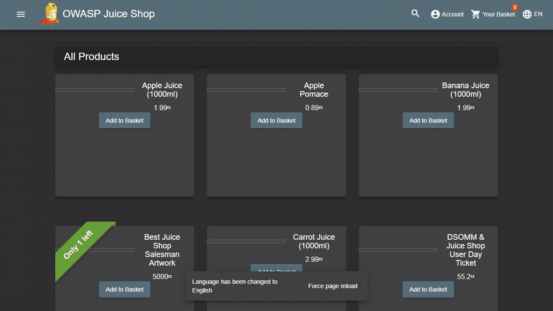
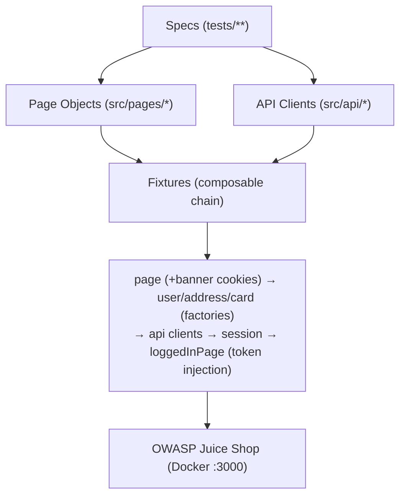

# Juice Shop E2E — Playwright + TypeScript

<!-- GitHub Pages: Settings → Pages → Source "GitHub Actions"; the nightly workflow deploys the Allure report. -->

[](https://github.com/tpqHUY/e2e-tests-juiceowasp/actions/workflows/smoke.yml)
[](https://github.com/tpqHUY/e2e-tests-juiceowasp/actions/workflows/nightly-regression.yml)

End-to-end test automation framework for a **real dockerized e-commerce app**
([OWASP Juice Shop](https://github.com/juice-shop/juice-shop)), covering the full
customer journey across **UI and API** — from registration through a completed
purchase — with the Page Object Model, API-first setup, faker-based data
factories, and schema-validated contract tests.

> **67 tests · 3 browser engines (201 runs) · fully parallel · 0 hard waits** — plus
> **9 unit tests** (Vitest) and **2 visual-regression** baselines.
> Tagged `@smoke` (14) / `@regression` (67) / `@api` (32) / `@security` (7) / `@a11y` / `@performance` / `@visual` for CI selection.
> **Static + unit + smoke checks on every push** (chromium) + **nightly, sharded, cross-browser regression** with an
> **[Allure trend report](https://tpqhuy.github.io/e2e-tests-juiceowasp/)** published to GitHub Pages.

---

## Demo

The full purchase journey — catalog → add to basket → checkout (address →
delivery → payment) → order confirmation — driven end-to-end through the UI and
verified via the API
([`tests/e2e/purchase-journey.spec.ts`](tests/e2e/purchase-journey.spec.ts)):



## Why this project

It exercises the same skills a QA/QC automation role needs on day one:

- **Layered architecture** — POM + component objects + typed API clients + composable fixtures.
- **API-first testing** — authenticate over HTTP and inject session state so UI tests start where the actual test begins (the `storageState` technique).
- **UI action → API verify** — drive the browser, then read the REST API to prove the backend agrees (the modern stand-in for a DB check on an API-driven SPA).
- **Contract testing** — every API response validated against a `zod` schema, not just its status code.
- **Parallel-safe by construction** — per-test data factories mean zero shared state.
- **Security-aware** — documented `@security` tests (SQLi, IDOR, XSS, /ftp exposure) plus defensive checks (JWT-tampering rejected, security headers).
- **Multiple test types** — accessibility (axe), API-latency budgets, visual regression, and Vitest unit tests for the framework's own helpers.
- **Shift-left CI** — dependency audit, CodeQL (SAST), Dependabot, and pre-commit hooks stop issues before they land.

## Tech stack

| Concern            | Choice                                           |
| ------------------ | ------------------------------------------------ |
| Runner / framework | Playwright Test + TypeScript                     |
| Test data          | `@faker-js/faker`                                |
| Schema validation  | `zod`                                            |
| App under test     | OWASP Juice Shop `v17.1.1` (Docker, pinned)      |
| Unit tests         | Vitest (framework helpers + factories)           |
| Accessibility      | `@axe-core/playwright`                           |
| Quality gates      | ESLint (flat config) + Prettier + `tsc --noEmit` |
| Pre-commit         | husky + lint-staged                              |
| Security in CI     | `npm audit` · CodeQL (SAST) · Dependabot         |

## Architecture



The **fixture chain** is the backbone: a spec that declares `loggedInPage`
transparently gets a fresh user (factory) → registered + logged in over the API
(`session`) → a browser page with the token/basket-id injected into storage — no
login form driven, full isolation, parallel-safe.

## Project structure

```
src/
├── pages/       # Page Objects: base, navbar, login, register, home, basket, ...
├── api/         # Typed REST clients + zod schemas (auth, product, basket)
├── fixtures/    # test-data + auth (storageState) fixtures, merged in index.ts
├── data/        # constants + faker factories (user, address, card)
└── utils/       # env, currency parsing, logger
src/pages/checkout/  # address, delivery, payment, order-summary, confirmation
tests/
├── ui/          # auth, catalog, basket, checkout UI suites
├── api/         # auth, products, basket, profile, reviews, admin suites
├── e2e/         # full purchase journey (register → pay), UI-driven
├── security/    # SQLi / IDOR / XSS / exposure + JWT-tampering / headers
├── a11y/        # accessibility (axe) checks
├── performance/ # API latency-budget smoke
├── visual/      # visual-regression baselines (chromium)
└── unit/        # Vitest unit tests (currency, factories)
docs/            # test-strategy · exploratory-notes · test-cases · adr · bug-reports
```

## Quick start

**Prerequisites:** Node ≥ 18, Docker Desktop.

```bash
# 1. install deps + browser
npm ci
npx playwright install chromium

# 2. start Juice Shop (pinned image) and wait until healthy
npm run app:up
npm run app:wait

# 3. run the suite
npm test
```

Tear down the app with `npm run app:down`.

## Running subsets

```bash
npm run test:smoke        # @smoke — the "is the store working?" subset (14)
npm run test:regression   # full regression (67), all browsers
npm run test:api          # API contract suites
npm run test:ui           # UI suites only
npm run test:security     # documented vulnerability + defensive tests (7)
npm run test:a11y         # accessibility (axe)
npm run test:performance  # API latency budgets
npm run test:visual       # visual regression (chromium)
npm run test:unit         # Vitest unit tests (9)
npm run test:chromium     # single engine (fast dev loop)
npm run report            # open the last Playwright HTML report
```

> Tip: run `npm run app:reset` before a big local cross-browser run — Juice Shop
> product stock is finite and depletes across many order-placing runs (a fresh
> container re-seeds full stock; CI always starts fresh).

## Reports

- **Playwright HTML** — generated every run; `npm run report`.
- **Allure** (trend/history) — `npm run allure:serve` (needs a JRE). The nightly
  workflow publishes it to GitHub Pages:
  `https://tpqhuy.github.io/e2e-tests-juiceowasp/`.

## Quality gates

```bash
npm run typecheck   # tsc --noEmit
npm run lint        # eslint
npm run format:check
```

## Patterns worth a look

| Pattern                                   | Where                                                                                  |
| ----------------------------------------- | -------------------------------------------------------------------------------------- |
| API-first auth + `storageState` injection | [`src/fixtures/auth.fixture.ts`](src/fixtures/auth.fixture.ts)                         |
| Page Object Model                         | [`src/pages/basket.page.ts`](src/pages/basket.page.ts)                                 |
| UI action → API verify                    | [`tests/ui/basket/basket.spec.ts`](tests/ui/basket/basket.spec.ts)                     |
| Full E2E purchase journey                 | [`tests/e2e/purchase-journey.spec.ts`](tests/e2e/purchase-journey.spec.ts)             |
| Multi-step checkout POM                   | [`src/pages/checkout/`](src/pages/checkout/)                                           |
| Schema (contract) validation              | [`src/api/schemas.ts`](src/api/schemas.ts)                                             |
| Data factories                            | [`src/data/factories/`](src/data/factories/)                                           |
| CI (smoke on push)                        | [`.github/workflows/smoke.yml`](.github/workflows/smoke.yml)                           |
| CI (nightly cross-browser + Allure)       | [`.github/workflows/nightly-regression.yml`](.github/workflows/nightly-regression.yml) |

## Documentation

- [Ways of working](docs/workflow/README.md) — how the project is run like a real QA job: ticket → PR → CI → merge, sprints, [flaky policy](docs/workflow/flaky-policy.md), [metrics](docs/workflow/metrics.md), [backlog](docs/workflow/backlog.md).
- [Test Strategy](docs/test-strategy.md) — scope, risk-based prioritisation, design decisions (interview Q&A).
- [Exploratory Notes](docs/exploratory-notes.md) — ground-truth selectors, endpoints, and the app quirks the framework handles.
- [Test Cases & Traceability](docs/test-cases.md) — requirement → test case → spec matrix.
- [Architecture Decision Records](docs/adr/) — the _why_ behind the framework's structure.
- [Contributing](CONTRIBUTING.md) — setup, conventions, and the rules every test follows.
- [Bug Reports](docs/bug-reports/) — JIRA-style defect reports (severity/priority/steps/actual/expected) for issues found while testing.

---

_OWASP Juice Shop is intentionally insecure software for security training. The
`@security` tests here document its known vulnerabilities for educational
purposes against a locally-run instance — they are not an attack on any
third-party system._
