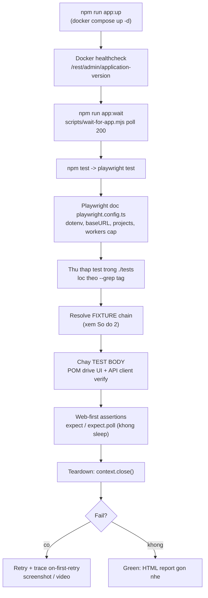
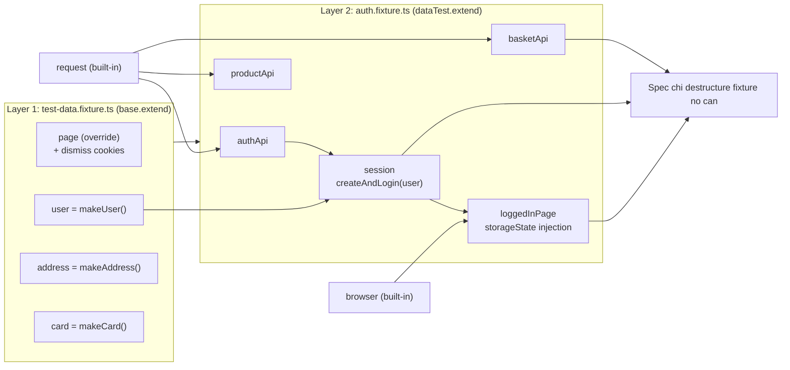

# Giải thích Flow & Thiết kế Framework — Juice Shop E2E

> Tài liệu này dành cho người muốn **hiểu** và **học cách thiết kế** một framework automation thật: bộ test Playwright + TypeScript chạy E2E cho OWASP Juice Shop. Chúng ta sẽ đi theo đúng thứ tự **một bài test thực sự chạy** — từ lúc chuẩn bị môi trường, `npm test`, Playwright đọc config, resolve fixtures theo chuỗi, chạy test body qua Page Object / API client, assertion, cho tới teardown — và ở mỗi bước đều giải thích **LÝ DO thiết kế (design rationale)**.

---

## 1. Bức tranh tổng thể — các tầng của framework

Framework được chia thành các **tầng (layer)** rõ ràng, mỗi tầng có một trách nhiệm duy nhất. Cách dễ nhớ: dữ liệu đi **từ dưới lên** (data -> API -> fixture -> test), còn quyền điều khiển đi **từ trên xuống** (config -> fixture -> POM/API -> app).

| Tầng                        | Trách nhiệm                                                                  | Thư mục chính                                                            |
| --------------------------- | ---------------------------------------------------------------------------- | ------------------------------------------------------------------------ |
| **Startup & Config**        | Dựng app (Docker), chờ app sẵn sàng, Playwright đọc config                   | `docker-compose.yml`, `scripts/wait-for-app.mjs`, `playwright.config.ts` |
| **Fixture chain**           | Setup per-test: dismiss overlay, tạo user, API client, login, inject session | `src/fixtures/`                                                          |
| **Page Object Model (POM)** | Trừu tượng hóa UI thành method "đọc như nghiệp vụ"                           | `src/pages/`                                                             |
| **API client (typed)**      | Gọi HTTP có kiểu, validate contract bằng zod                                 | `src/api/`                                                               |
| **Data layer**              | Hằng số, faker factory, currency helper                                      | `src/data/`, `src/utils/`                                                |
| **Tests**                   | Spec thật (UI + API + security)                                              | `tests/`                                                                 |

> [!NOTE]
> **Nguyên tắc xương sống:** mỗi test sở hữu dữ liệu riêng (throwaway user), login qua API chứ không qua form, và state của session được **inject** thẳng vào browser. Nhờ vậy toàn bộ suite chạy **song song an toàn** mà không cần cleanup.

### Sơ đồ 1 — Flow chạy một bài test từ đầu đến cuối



### Sơ đồ 2 — Chuỗi resolve FIXTURE (lazy, theo dependency)



---

## 2. Bước 0 — Chuẩn bị môi trường

Trước khi bất cứ test nào chạy, phải có một app Juice Shop **đang chạy và sẵn sàng trả lời**. Có **hai lớp kiểm tra độc lập** cùng trỏ tới một endpoint version, để test không bao giờ khởi động khi app còn "ngủ".

### 2.1 Dựng container: `npm run app:up`

Script `app:up` chạy `docker compose up -d`. File `docker-compose.yml` định nghĩa **một** service `juice-shop`:

```yaml
image: bkimminich/juice-shop:v17.1.1 # image duoc PIN
ports: ['3000:3000']
environment:
  NODE_ENV: unsafe # giu tat ca challenge/feature BAT
restart: unless-stopped
```

**Lý do thiết kế:**

- **Pin image tag `v17.1.1`**: một bản release mới từ upstream sẽ không bao giờ **âm thầm** làm vỡ suite. Muốn nâng cấp phải có chủ định, và sau đó chạy lại regression.
- **`NODE_ENV=unsafe`**: bắt buộc, để các security challenge vẫn được bật cho test tương tác. Nếu để env thường, app sẽ tắt các challenge mà test dựa vào.

### 2.2 Healthcheck cấp container (chi tiết distroless `/nodejs/bin/node`)

`docker-compose.yml` định nghĩa healthcheck gọi `http://localhost:3000/rest/admin/application-version`, chỉ exit 0 khi HTTP 200. Điểm then chốt: probe gọi node theo **đường dẫn tuyệt đối** `/nodejs/bin/node`, không phải `node`:

```yaml
test: ['CMD','/nodejs/bin/node','-e',
  "require('http').get('http://localhost:3000/rest/admin/application-version',
   r => process.exit(r.statusCode === 200 ? 0 : 1)).on('error', () => process.exit(1))"]
interval: 10s   timeout: 5s   retries: 12   start_period: 20s
```

> [!WARNING]
> **Gotcha distroless:** image Juice Shop là **distroless** — không có shell, không có `curl`/`wget`, và `node` **không nằm trên `$PATH`** (nó ở `/nodejs/bin/node`). Một healthcheck kiểu shell hoặc curl sẽ **âm thầm thất bại** trên image này. Do đó probe dùng binary tuyệt đối + một dòng `require('http').get(...)`.

### 2.3 Cổng sẵn sàng cấp ứng dụng: `npm run app:wait`

Script `app:wait` chạy `node scripts/wait-for-app.mjs`. Script poll `${BASE_URL}/rest/admin/application-version` (mặc định `http://localhost:3000`) mỗi `INTERVAL_MS = 3_000`ms, coi HTTP 200 là up. Mỗi request dùng `req.setTimeout(4_000)`; vòng lặp tối đa `WAIT_TIMEOUT_MS` (mặc định `120_000`ms) rồi `process.exit(0)` khi thành công (in số giây) hoặc `process.exit(1)` khi timeout.

**Lý do thiết kế:**

- Là **cổng sẵn sàng hướng caller**, dùng cả local lẫn CI sau `docker compose up -d` — test không bao giờ chạy vào app chưa ready.
- Tách rời và có thể override qua env (`BASE_URL`, `WAIT_TIMEOUT_MS`), nên cùng script cho local Docker, CI, hoặc target từ xa.
- Viết dạng ESM (`.mjs`), chỉ dùng `node:http`, **không phụ thuộc** (vì `package.json` có `type: module`).

> [!NOTE]
> Hai check dùng ngân sách thời gian **khác nhau** (có chủ định): container dùng interval 10s / timeout 5s / retries 12 / start_period 20s; script dùng 120s tổng / poll 3s / per-request 4s. Redundant gating = test càng chắc không khởi động vào app lạnh.

---

## 3. Bước 1 — `npm test` & `playwright.config.ts`

`npm test` map thẳng tới `playwright test`. Playwright load `playwright.config.ts`.

### 3.1 dotenv + single source of truth

```ts
dotenv.config();
const BASE_URL = process.env.BASE_URL ?? 'http://localhost:3000';
const IS_CI = !!process.env.CI;
// testDir: './tests'  outputDir: './test-results'
```

**Lý do:** `.env` là một núm vặn duy nhất chọn target. `?? 'http://localhost:3000'` nghĩa là một checkout trần chạy ngay với Docker local, không cần setup. `IS_CI` được suy ra một lần rồi dùng để rẽ nhánh retries/workers/forbidOnly/reporters (GitHub Actions tự set `CI=true`). `src/utils/env.ts` là bản mirror của logic này (`baseURL`, `isCI`) — **single source of truth**.

### 3.2 baseURL & testIdAttribute

```ts
use: { baseURL: BASE_URL, testIdAttribute: 'data-test', ... }
```

**Lý do:** tập trung `baseURL` nên đổi giữa local/CI/staging chỉ là một env var. `testIdAttribute` được override thành `'data-test'` (thay vì mặc định `data-testid`) vì đó là attribute UI Angular của Juice Shop **thực sự** phơi ra — nếu không, `getByTestId()` sẽ không khớp DOM.

### 3.3 Browser project matrix

Ba project: `chromium`, `firefox`, `webkit`. Mặc định chạy cả ba; các script thu hẹp phạm vi: `test:chromium` -> `--project=chromium`, `test:smoke` -> `--grep @smoke`, v.v.

**Lý do:** biểu diễn browser matrix bằng **projects** cho phép cùng một config phục vụ nhiều stage CI (vd `@smoke` trên chromium cho PR, nightly regression trên cả ba engine) mà **không nhân đôi config**.

### 3.4 Parallelism & worker cap (VÌ SAO cap)

```ts
fullyParallel: true,
workers: IS_CI ? 2 : 4,
```

**Lý do (rất quan trọng):**

- `fullyParallel` an toàn **chỉ vì** test dùng per-test data factory — không có shared mutable state giữa các worker.
- Worker cap là **quyết định ổn định, không phải con số tùy tiện**: Juice Shop là **một** container trên nền **SQLite**. Quá nhiều worker sẽ làm quá tải app, gây **load-induced timeout** — trông như fail nhưng không phải fail thật. Cap vừa phải giữ suite vừa song song vừa ổn định, vẫn xong dưới 10 phút.

### 3.5 retries & forbidOnly

```ts
forbidOnly: IS_CI,
retries: IS_CI ? 2 : 1,
```

**Lý do:** retries hấp thụ flakiness tàn dư (vd app load nhất thời) mà không che giấu hoàn toàn, kết hợp với trace-on-first-retry để debug. `forbidOnly` làm fail build nếu ai đó lỡ `test.only` trong source khi chạy CI (nếu không, nó sẽ âm thầm skip phần còn lại của suite).

### 3.6 Timeouts phân tầng

| Mức                 | Giá trị      |
| ------------------- | ------------ |
| Per-test `timeout`  | 45_000 (45s) |
| `expect.timeout`    | 10_000 (10s) |
| `actionTimeout`     | 10_000 (10s) |
| `navigationTimeout` | 20_000 (20s) |

**Lý do:** ngân sách phân tầng — fail nhanh ở action/assertion bị kẹt (10s) nhưng chờ navigation cả trang chậm hơn (20s), tất cả roll-up vào trần 45s. Cân bằng giữa feedback fail nhanh và thời gian load thực của Juice Shop.

### 3.7 Reporters (CI vs local)

- CI: `[['list'], ['html', { open: 'never' }], ['github']]`
- Local: `[['list'], ['html', { open: 'never' }]]`

**Lý do:** `list` cho output trực tiếp ở mọi nơi; `html` luôn sinh nhưng **không bao giờ tự mở** (`open: 'never'`) để không chặn CI hay ngắt quãng local — xem bằng `npm run report`. `github` chỉ thêm ở CI để hiện fail thành annotation inline.

### 3.8 Debug artifacts

```ts
trace: 'on-first-retry',
screenshot: 'only-on-failure',
video: 'retain-on-failure',
```

**Lý do:** chỉ bật artifact khi fail/retry -> run xanh nhanh và nhỏ, nhưng vẫn đủ timeline (trace), ảnh, và video để debug. `trace: 'on-first-retry'` là **đòn bẩy debug flaky then chốt**: không tốn overhead khi pass, có full timeline ngay khi test flake lần retry đầu tiên.

---

## 4. Bước 2 — Playwright thu thập test & lọc theo tag

Playwright quét `testDir: './tests'`, thu thập mọi file `*.spec.ts`, rồi áp dụng bộ lọc `--grep` nếu có.

- `npm run test:smoke` -> `playwright test --grep @smoke` (12 test — cổng nhanh mỗi push).
- `npm run test:regression` -> `--grep @regression` (47 test — toàn bộ suite, nightly).
- `npm run test:api` -> `playwright test tests/api` (lọc theo **thư mục**, không phải grep).
- `npm run test:chromium` -> `--project=chromium` (lọc theo project).

**Lý do:** tag là thuộc tính khai báo **inline** trên từng test (`{ tag: [...] }`), tách biệt "test nói về cái gì" khỏi "khi nào CI chạy nó". Một suite phẳng phục vụ nhiều ngữ cảnh CI mà không nhân đôi spec.

---

## 5. Bước 3 — Vòng đời FIXTURE (quan trọng nhất)

Đây là trái tim của framework. Fixture được soạn thành **hai layer** bằng `extend()`; mỗi spec **lắp ráp lưới** bằng cách chỉ destructure fixture nó gọi tên. Playwright resolve theo **topo** (dependency trước), setup quanh một `await use(...)`, và teardown theo **thứ tự ngược**.

### 5.1 Layer 1 — override `page` (dismiss overlay)

`src/fixtures/test-data.fixture.ts` override fixture `page` sẵn có của Playwright. Trước khi yield page, nó seed hai `DISMISS_COOKIES` (`welcomebanner_status=dismiss`, `cookieconsent_status=dismiss`) vào `context`, scope theo `env.baseURL`, rồi `await use(page)`.

```ts
page: async ({ page, context }, use) => {
  await context.addCookies(
    DISMISS_COOKIES.map((c) => ({
      name: c.name,
      value: c.value,
      url: env.baseURL,
    }))
  );
  await use(page);
};
```

**Lý do:** Juice Shop render welcome banner + cookie bar khi load lần đầu; set đúng cookie app kiểm tra nghĩa là overlay không bao giờ render — không test nào tốn thời gian (hay flake) click tắt. Override chính fixture **mặc định** khiến việc này tự động cho mọi test dùng `page`.

### 5.2 Layer 1 — data factory: user / address / card mới cho mỗi test

Ba fixture, mỗi cái gọi một faker factory: `user -> makeUser()`, `address -> makeAddress()`, `card -> makeCard()`. `makeUser()` tạo email unique toàn cục (`qa.<base36-timestamp>.<8 random>@e2e.local`), password hợp lệ, security-question id 1.

**Lý do — VÌ SAO mỗi test 1 user:** vì mỗi test sở hữu dữ liệu **hoàn toàn mới**, không gì chia sẻ giữa các test, nên suite chạy fully parallel với **zero shared-state collision, không cleanup, không flakiness kiểu "test A logout test B"**. Uniqueness = timestamp + random nên worker song song không bao giờ đụng email. Mỗi factory nhận `overrides` để negative test ghim một field (vd password yếu) còn lại vẫn random.

### 5.3 Layer 2 — API client: authApi / productApi / basketApi

`auth.fixture.ts` gọi `dataTest.extend<AuthFixtures>(...)`, nên Layer 2 được xây **trên** Layer 1. Mỗi client bọc `request` (APIRequestContext) built-in vào một class: `new AuthApi(request)`, `new ProductApi(request)`, `new BasketApi(request)`. `BaseApi` tập trung JSON header + bearer-token.

**Lý do:** extend `dataTest` (không phải `base`) chính là cái **hợp nhất hai layer thành một chuỗi** — Layer 2 có thể phụ thuộc `user` của Layer 1, và spec lấy tất cả từ một `test`. Bọc **cùng** `request` context nghĩa là API call chia sẻ network stack, proxy, và tracing với browser.

### 5.4 Layer 2 — `session`: register + login qua API

`session` phụ thuộc `authApi` + `user`, gọi `authApi.createAndLogin(user)`. Hàm này: POST `/api/Users` (register) -> POST `/api/SecurityAnswers` -> POST `/rest/user/login` -> validate body bằng `LoginResponseSchema` (zod) -> `setToken()` -> trả `{ token, bid, email }`. Né bất kỳ non-2xx nào.

**Lý do — VÌ SAO login qua API:** tạo + xác thực user qua HTTP **nhanh hơn một bậc** và **ít flaky hơn nhiều** so với drive form register/login mỗi test. UI login **vẫn** được test — nhưng chỉ trong spec login/register riêng, không phải làm setup cho mọi test khác. `zod` biến "200 nhưng body sai" thành fail đọc được ngay, và sinh `token`/`bid` có kiểu cho fixture hạ nguồn.

> [!NOTE]
> **VÌ SAO có POST /api/SecurityAnswers riêng:** `/api/Users` tạo account nhưng **không lưu** security answer. Nếu thiếu bước thứ hai, test password-recovery sẽ fail. Bước này mirror đúng hành vi UI thật.

### 5.5 Layer 2 — `loggedInPage`: storageState injection

Phụ thuộc `browser` + `session`. Nó tạo context **mới** qua `browser.newContext()`, rồi:

1. `addCookies`: dismiss cookies + cookie `token` = `session.token`, scope `env.baseURL`.
2. `addInitScript` chạy trước app code ở mỗi navigation, ghi `localStorage['token']=session.token` và `sessionStorage['bid']=String(session.bid)`.
3. `context.newPage()`, `await use(page)`, teardown `context.close()`.

```ts
await context.addInitScript(
  ([token, bid, tokenKey, bidKey]) => {
    window.localStorage.setItem(tokenKey, token);
    window.sessionStorage.setItem(bidKey, bid);
  },
  [session.token, String(session.bid), STORAGE.tokenKey, STORAGE.basketIdKey]
);
const page = await context.newPage();
await use(page);
await context.close();
```

**Lý do:** Juice Shop đọc JWT từ **CẢ** cookie `token` **VÀ** `localStorage['token']`, và basket id từ `sessionStorage['bid']` — nên cả ba nơi đều được seed để app Angular tin rằng có login thật. Kỹ thuật "storageState injection" này khiến UI test mở app **đã đăng nhập sẵn**, bỏ qua form login. Nó xây context riêng (không tái sử dụng `page` của Layer 1) vì storage/cookie phải có **trước** navigation đầu tiên. `context.close()` sau `use()` dọn context + page **tất định** kể cả khi fail.

### 5.6 VÌ SAO sessionStorage phải dùng addInitScript

Token đặt qua cookie VÀ localStorage, nhưng `bid` ghi vào **sessionStorage** — và ghi **bên trong addInitScript**, không phải addCookies, không phải storageState file.

> [!WARNING]
> **Gotcha then chốt:** Playwright `storageState` chỉ serialize **cookie và localStorage**, **KHÔNG bao gồm sessionStorage** (sessionStorage là per-tab, không bao giờ được lưu/khôi phục). Cách duy nhất để seed nó là chạy script trong page **trước khi app boot**. `addInitScript` chạy ở mỗi navigation trước app JS, nên đặt `sessionStorage['bid']` ổn định ở load đầu và ở reload. Do đó fixture dùng addInitScript cho cả localStorage lẫn sessionStorage trong một lần (truyền token, bid, và tên key như arg serializable).

### 5.7 index.ts — hợp nhất thành một import surface

`src/fixtures/index.ts` re-export `{ test, expect }` từ `auth.fixture.js`. Vì `test` của auth.fixture là `dataTest.extend(...)`, cái `test` xuất ra đã mang **cả hai layer** fixture. Spec import từ một path duy nhất và không cần biết chuỗi được nối dây thế nào.

### 5.8 Spec khai báo đúng cái nó cần — resolve lazy

Spec destructure fixture trong callback, vd `async ({ loggedInPage, session, basketApi }) => {...}`. Playwright chỉ khởi tạo **các fixture được gọi tên cộng transitive dependency**. Gọi `loggedInPage` kéo theo `session` -> `authApi` + `user`; `basketApi` kéo theo `request`. Test không gọi tên `address`/`card`/`productApi` thì **không** chạy chúng.

**Lý do:** resolve lazy theo dependency giữ setup tối thiểu và nhanh — chỉ trả tiền cho fixture bạn dùng. Cùng một `test` phục vụ cả spec thuần API (chỉ `authApi`, `user`) lẫn spec UI+API đầy đủ.

### 5.9 Thứ tự setup / teardown

Setup **trước** / teardown **sau** quanh một `await use()` là hợp đồng lifecycle của Playwright. Cho `{ loggedInPage, session, basketApi }`: setup theo dependency (page-override + `user` -> `authApi` -> `session` -> `loggedInPage`), teardown **ngược** (`context.close()` chạy trước). Nhờ vậy per-test context (và storage inject) luôn được dọn kể cả khi fail — không rò rỉ context qua run song song.

---

## 6. Bước 4 — Test body qua POM

POM (`src/pages/`) trừu tượng hóa UI thành method "đọc như nghiệp vụ", nên spec đọc như **đặc tả hành vi** chứ không phải "selector soup".

### 6.1 BasePage — xương sống dùng chung

```ts
export abstract class BasePage {
  constructor(protected readonly page: Page) {}
  async open(path) { await this.page.goto(path); await this.dismissOverlays(); }
  ...
}
```

`abstract` = không bao giờ khởi tạo trực tiếp. `open(path)` gọi `page.goto(path)` rồi **ngay** `dismissOverlays()` — vì navigation và dọn overlay không thể tách rời trong Juice Shop. `dismissOverlays()` là **best-effort**: duyệt danh sách selector, `.isVisible().catch(() => false)`, `.click().catch(() => {})` — nuốt mọi lỗi, không bao giờ throw/block. `snackbar` getter (`protected`) trả union selector `'simple-snack-bar, .mat-snack-bar-container, .cdk-overlay-container'` — bề mặt toast Material dùng khắp app.

### 6.2 Component object vs Page object

|                   | Page object                                                       | Component object                             |
| ----------------- | ----------------------------------------------------------------- | -------------------------------------------- |
| Bản chất          | Màn hình bạn **điều hướng TỚI**                                   | Widget bạn **compose VÀO** page              |
| Có `goto()`?      | Có                                                                | Không                                        |
| Extends BasePage? | Có                                                                | Không (plain class)                          |
| Ví dụ             | LoginPage, HomePage, BasketPage, RegisterPage, ForgotPasswordPage | `NavbarComponent`, `ProductDetailsComponent` |

**Lý do:** `NavbarComponent` có mặt trên **mọi** page và được compose vào (`this.navbar = new NavbarComponent(page)`) — quan hệ **has-a**, không phải inheritance. `ProductDetailsComponent` root là `mat-dialog-container` (một **modal**, không phải route), nên không thể là page object có `goto()`; child locator scope trong `this.dialog` để không khớp nhầm element sau modal.

### 6.3 Locator khai báo một lần trong constructor

Mỗi object khai báo locator là field `readonly`, gán trong constructor. Ưu tiên role/label/ID hơn CSS giòn:

```ts
emailInput = page.locator('#email');
loginButton = page.locator('#loginButton');
forgotPasswordLink = page.getByRole('link', { name: /forgot your password/i });
```

**Lý do:** một chỗ khai báo cho mỗi element -> đổi selector là sửa một dòng, không phải find-replace khắp spec. Locator lazy trong Playwright nên xây trong constructor rẻ và re-resolve mỗi lần dùng.

### 6.4 Method "đọc như nghiệp vụ"

`LoginPage.login(email, password)` fill + click submit (cố tình **không** assert kết quả — "callers decide expectations" — để cả positive lẫn negative test tái sử dụng). `HomePage.addFirstProductToBasket()` đọc tên sản phẩm đầu, click Add-to-Basket, và **trả về tên** cho assertion sau. `RegisterPage` tách `fillForm()/submit()/register()` để negative test kiểm tra state trước submit.

### 6.5 Các mẹo (workaround sống trong đúng một chỗ)

**Retry mở mat-select** (`RegisterPage.selectSecurityQuestion`): Angular Material overlay đôi khi không mở ở click đầu khi tải nặng. Loop tối đa 3 lần: click mở, `option.waitFor({ state: 'visible', timeout: 3000 })`, `break` khi thành công; khi timeout thì `Escape` reset trạng thái nửa-mở rồi retry.

```ts
for (let attempt = 0; attempt < 3; attempt++) {
  await this.securityQuestionSelect.click();
  try {
    await option.waitFor({ state: 'visible', timeout: 3000 });
    break;
  } catch {
    await this.page.keyboard.press('Escape').catch(() => {});
  }
}
```

**pressSequentially** (`ForgotPasswordPage.enterEmail`): Juice Shop suy ra security question từ **debounced `valueChanges`** của field email. `fill()` set giá trị một phát và **không** fire đáng tin cậy input event, nên lookup không chạy và field answer bị disabled. Gõ từng ký tự (`pressSequentially(email, { delay: 15 })`) emit đúng event debounce cần; rồi `waitFor({ state: 'visible' })` field answer là tín hiệu đồng bộ lookup đã xong.

**Basket table scoping** (`BasketPage`): `row(name)` filter `mat-row` theo cell sản phẩm chứa tên; mọi accessor scope dưới row đó. Nút +/- addressing theo **vị trí index**: `nth(1)` = tăng, `nth(0)` = giảm (hai icon button không label). `quantityCell()` trả về **Locator thô** để spec dùng web-first `toHaveText` retryable thay vì đọc một-phát.

### 6.6 Web-first assertions

Method trả về **domain value** (tên -> string, `quantityOf` -> number) cho đọc imperative, nhưng trả **Locator** khi test cần auto-waiting assertion. Route/reference data tập trung (`ROUTES`, `SECURITY_QUESTION`); giá hiển thị normalize qua `parsePrice`. Kết quả: spec là chuỗi bước nghiệp vụ, không selector, không wait, không parse tiền inline.

---

## 7. Bước 5 — Tầng API client + zod

Tầng HTTP mỏng, có kiểu, trên `APIRequestContext` của Playwright.

### 7.1 BaseApi — network context + token

```ts
constructor(protected readonly request: APIRequestContext, protected token?: string) {}
setToken(token?) { this.token = token; return this; }   // chainable
headers(extra) {
  return { 'Content-Type': 'application/json',
    ...(this.token ? { Authorization: `Bearer ${this.token}` } : {}),
    ...extra };
}
```

**Lý do:** tái sử dụng `APIRequestContext` = API call chia sẻ cùng network stack/proxy/baseURL/**trace** với browser test — setup/verify traffic hiện trong cùng Playwright trace. Header `Authorization` có điều kiện khiến negative auth test **tầm thường**: client chưa set token gửi request **unauthenticated**, tự nhiên exercise đường 401. `httpGet/httpPost/httpPut/httpDelete` (protected) tự inject `this.headers()`, giữ layering.

### 7.2 zod schema = response contract

`src/api/schemas.ts` khai báo schema cho mọi shape (`ProductSchema`, `LoginResponseSchema`, `BasketResponseSchema` có nested `BasketProductSchema`, ...). Type suy ra bằng `z.infer` -> `Product`, `LoginResponse` single-sourced từ schema. Contract chính xác: `status: z.literal('success')`, `token: z.string().min(1)`, `umail: z.string().email()`, `BasketProductSchema.BasketItem.BasketId: z.number()`; riêng response add-item (`BasketItemResponseSchema`) có `data.BasketId: z.union([number, string])` để khớp sự lỏng lẻo thật của API.

**Lý do — VÌ SAO validate schema (không chỉ status):** một **200 với body sai** vẫn là bug. Parse mọi response qua zod biến "API contract đổi" thành fail **đọc được ngay tại field**, thay vì một `undefined` khó hiểu ở hạ nguồn. Và có type miễn phí — một khai báo sinh cả runtime guard lẫn compile-time type, không bao giờ lệch nhau.

### 7.3 AuthApi.register — VÌ SAO hai lời gọi (Users + SecurityAnswers)

```ts
// POST /api/Users
if (res.ok()) {
  const userId = (await res.json())?.data?.id;
  if (userId) {
    await this.httpPost(ENDPOINTS.securityAnswers,
      { UserId: userId, SecurityQuestionId: ..., answer: ... });
  }
}
return res;   // tra RAW response dau
```

**Lý do:** mirror UI Juice Shop thật. `/api/Users` tạo account nhưng **không lưu** security answer; thiếu follow-up thì password-recovery không tìm được question của account (xác nhận qua exploratory testing, ghi trong comment). Gọi thứ hai được guard bởi `res.ok()` + `userId` truthy nên register fail không bắn gọi rác.

### 7.4 raw vs parsed (mẫu then chốt)

Mỗi client có **hai vị**: biến **raw** trả `APIResponse` (cho assert status + negative test) và biến **parsed** chạy zod trả domain data có kiểu.

| Client     | raw                                           | parsed                                       |
| ---------- | --------------------------------------------- | -------------------------------------------- |
| AuthApi    | `login()`, `register()`                       | `createAndLogin()` (throw neu non-2xx)       |
| ProductApi | `listRaw()`, `searchRaw()`                    | `list()`, `search()`, `getById()`, `first()` |
| BasketApi  | `getRaw()`, `addItemRaw()`, `removeItemRaw()` | `get()`, `quantityOf()`, `lineCount()`       |

**Lý do:** hai vị phục vụ hai nhu cầu đối lập. Raw = API spec assert status/error shape. Parsed = "cho tôi user đã login"/assertion positive, fail **loud** (throw) tại setup. `createAndLogin` còn bắt `bid` (basket id) từ login body — cái `loggedInPage` cần inject vào storage.

---

## 8. Bước 6 — Data factory (faker) & currency helper

### 8.1 constants (`src/data/constants.ts`) — frozen `as const`

- `ROUTES` — path hash-router SPA (`home: '/#/'`, `login: '/#/login'`, ...).
- `STORAGE` — `tokenKey: 'token'` (JWT ở **CẢ** localStorage lẫn cookie), `basketIdKey: 'bid'` (sessionStorage).
- `DISMISS_COOKIES` — cặp cookie tắt overlay.
- `SECURITY_QUESTION` — ghim `id: 1` + `text` (Juice Shop reseed mỗi boot nên id 1 tất định).
- `KNOWN_PRODUCTS` — appleJuice (id 1, 1.99), orangeJuice (id 2, 2.99) làm anchor tất định.
- `ENDPOINTS` — trộn string (`login: '/rest/user/login'`) và **builder function** (`basket: (id) => `/rest/basket/${id}``).

**Lý do:** `as const` freeze giá trị + narrow về literal type -> autocomplete + bắt typo compile-time. Function-valued endpoint encode "id-in-path" một lần nên spec không thể malform URL.

### 8.2 Factory — random by default, pinned where it matters

- `makeUser()`: email unique = `${Date.now().toString(36)}.${faker.string.alphanumeric(8).toLowerCase()}` -> `qa.<token>@e2e.local`; password `Pw!` + 9 random (12 ký tự, trong rule 5-40); securityQuestionId từ `SECURITY_QUESTION`.
- `makeAddress()`: `mobileNumber: faker.string.numeric(10)`, `zipCode: faker.string.numeric(5)` — **chỉ số** (form Juice Shop validate numeric).
- `makeCard()`: `cardNumber: faker.string.numeric(16)`, `expiryYear = now.getFullYear() + 1..5` (luôn tương lai).

**Lý do:** token = timestamp (monotonic) + 8 random (chống đụng ở cùng millisec) -> register **không bao giờ** fail vì trùng email, không cần global counter. `overrides: Partial<T>` merge cuối -> negative test ghim một field (password yếu, card hết hạn) còn lại vẫn hợp lệ. Factory được thiết kế để **qua được validator thật** của Juice Shop, nên fail chỉ điểm vào hành vi sản phẩm, không phải noise của fixture.

### 8.3 currency helper (`src/utils/currency.ts`) — float noise

```ts
parsePrice(text); // '1.99¤' -> 1.99; throw neu empty/non-numeric; replace(',', '.')
roundMoney(v); // Math.round((v + Number.EPSILON) * 100) / 100  (half-up)
calcTotal(items); // sum(price*quantity) -> roundMoney
```

**Lý do:** app render tiền là text có placeholder tiền tệ (`¤`); assertion cần số thật. `roundMoney` giết float noise như `6.970000000000001` (chính Juice Shop lộ ra) — cộng `Number.EPSILON` trước khi scale để nứt giá trị ngay dưới biên làm tròn lên đúng. `calcTotal` tái sử dụng `roundMoney` -> một chính sách rounding duy nhất toàn codebase.

> [!WARNING]
> **Gotcha:** `parsePrice` chỉ replace comma **đầu tiên**, và `roundMoney` là half-up (không phải banker's rounding). An toàn **chỉ vì** Juice Shop render giá không có dấu phân cách hàng nghìn.

---

## 9. Bước 7 — Pattern "UI action -> API verify state"

Đây là mẫu **chữ ký** của framework: drive browser làm một action, rồi **đọc backend qua HTTP** để chứng minh server đồng ý. Minh họa bằng test thật trong `tests/ui/basket/basket.spec.ts` — "thêm sản phẩm từ catalog vào basket":

```ts
test(
  'adding a product from the catalog puts it in the basket',
  { tag: ['@smoke', '@regression'] },
  async ({ loggedInPage, session, basketApi }) => {
    // 1) basketApi la instance RIENG voi authApi -> phai set token
    basketApi.setToken(session.token);

    // 2) UI: navigate + THE UI ACTION
    const home = new HomePage(loggedInPage);
    await home.goto(); // open('/#/search') + dismissOverlays + waitFor card
    const name = await home.addFirstProductToBasket(); // doc ten, click Add, tra ten

    // 3) THE API VERIFY: doc backend basket, retry cho consistency
    await expect
      .poll(async () => (await basketApi.get(session.bid)).Products.map((p) => p.name))
      .toContain(name);

    // 4) Cross-check UI: row hien trong basket page
    const basket = new BasketPage(loggedInPage);
    await basket.goto();
    await expect(basket.row(name)).toBeVisible();
  }
);
```

Giải thích từng dòng:

- **`basketApi.setToken(session.token)`** (bắt buộc): `basketApi` và `authApi` (đã login) là hai instance `BaseApi` **riêng biệt**, token không được chia sẻ. Thiếu dòng này -> GET `/rest/basket/:bid` **unauthorized**.
- **`home.addFirstProductToBasket()`** là action người dùng thật: click thật trên nút catalog thật, trả tên để assert đúng sản phẩm đã thêm.
- **`expect.poll(... basketApi.get(session.bid) ...)`** là **crux**: sau khi drive UI, nó chứng minh server **thực sự persist** thay đổi — bắt lớp bug mà UI-only (render lạc quan) hoặc API-only bỏ lỡ. Mỗi lần poll: `httpGet /rest/basket/:bid` (có bearer) -> zod-parse `BasketResponseSchema` -> map tên. `session.bid` từ login response trỏ đúng basket mà `sessionStorage['bid']` của UI trỏ tới.
- **`toBeVisible()`** đóng vòng: sau khi backend đồng ý, xác nhận sản phẩm cũng render trong basket UI. Web-first assertion tự auto-wait/retry qua navigation + Angular render.

> [!NOTE]
> Test thứ hai ("basket total = tổng line price") **đảo ngược** nửa setup: seed basket **trực tiếp** qua `basketApi.addItemRaw` (API-first setup, 2x APPLE + 1x ORANGE), rồi drive **chỉ UI** đọc giá/quantity + `#price`, và assert `totalPrice()` `toBeCloseTo(calcTotal(lines), 2)` — dùng `toBeCloseTo` + `roundMoney` để hấp thụ float noise.

---

## 10. Bước 8 — Assertion, auto-waiting, expect.poll, không sleep cứng

Framework **không có hard wait/sleep**. Readiness dùng web-first primitive:

| Nhu cầu                    | Công cụ                                              | Ví dụ                        |
| -------------------------- | ---------------------------------------------------- | ---------------------------- |
| Chờ element render         | `locator.waitFor()`                                  | `home.goto()` chờ card đầu   |
| Assert UI trạng thái       | `expect(locator).toBeVisible/toHaveText/toHaveCount` | `basket.row(name)`           |
| Chờ giá trị fetch qua HTTP | `expect.poll(async fn)`                              | đọc backend basket           |
| Chờ lookup async UI        | `waitFor({ state: 'visible' })`                      | field answer forgot-password |

**Lý do:** mỗi chờ đợi trên **post-condition thật** (option render, dialog xuất hiện, row hiện) chứ không phải delay cố định — đây là thuốc giải flaky đúng cho async UI. `expect.poll` bọc một HTTP read async, retry tới expect timeout (10s) để hấp thụ **eventual consistency** giữa click và backend write. Vì zod parse mọi response, một contract change throw ngay tại read site với thông báo đọc được.

---

## 11. Bước 9 — Kết thúc: teardown, retry, trace khi fail

- **Teardown:** sau khi body trả về, `loggedInPage` chạy tiếp qua `use(page)` và `context.close()`; API client (dựa trên `request`) được dọn theo built-in `request` fixture. Dọn per-test context = worker song song không rò rỉ state.
- **Retry:** 1 local / 2 CI — safety net cho flakiness tàn dư, **không** phải crutch (root-cause flaky thật — container SQLite quá tải — đã fix bằng worker cap).
- **Trace khi fail:** `trace: 'on-first-retry'` cho full timeline ngay lần retry đầu; `screenshot: 'only-on-failure'`; `video: 'retain-on-failure'`. Xem HTML report bằng `npm run report`.

---

## 12. Bước 10 — Tagging & CI chọn suite

**Bốn tag** (khai báo inline `{ tag: [...] }`, orthogonal, kết hợp được):

| Tag           | Ý nghĩa                                       | Số lượng (verified) |
| ------------- | --------------------------------------------- | ------------------- |
| `@smoke`      | Subset store-hoạt-động cơ bản — chạy mỗi push | **12**              |
| `@regression` | Mọi test = full nightly suite                 | **47**              |
| `@api`        | Contract test tầng HTTP                       | **20**              |
| `@security`   | Probe lỗ hổng OWASP có tài liệu               | **3**               |

CI slice bằng `--grep`: per-push chạy 12-test smoke gate; nightly chạy 47-test regression; cả hai từ **cùng** config. Browser matrix là **projects** (chromium/firefox/webkit) — trục độc lập với tag: `@smoke` trên chromium mỗi push, full regression cả ba engine nightly.

**Ưu tiên theo risk:** P1 = auth + basket total (revenue-blocking) -> `@smoke`, chạy mỗi push. P2 = catalog/search. P3 = security smoke. Cosmetic/layout **không** automate ở E2E.

> [!WARNING]
> **Gotchas đếm tag:** grep thô `@security` trả **4** hit nhưng chỉ **3** là test tag — hit thứ 4 là title `test.describe('Security smoke @security', ...)`. `@api` (20) **bao gồm 2** security probe cùng chạm HTTP layer (không chỉ 18 file trong `tests/api`). `test:api`/`test:chromium` lọc theo **thư mục/project**, không phải `--grep`. Security test cố tình assert hành vi **hiện tại (vulnerable)** của Juice Shop để giữ xanh — **đừng "sửa"** chúng thành mong đợi secure. CI pipeline + published report là **roadmap** (week 4-5), chưa xong.

---

## 13. Nguyên tắc thiết kế then chốt + Q&A phỏng vấn

**Nguyên tắc then chốt:**

1. **Single source of truth env-driven** — `baseURL`/`isCI` từ `process.env` ở cả `playwright.config.ts` lẫn `src/utils/env.ts`; đổi target = một env var, zero code change.
2. **Parallel-safe by construction** — per-test throwaway user + factory, không shared state, không cleanup.
3. **API-first setup** — register/login qua HTTP, nhanh & ổn định; UI login chỉ test ở spec riêng.
4. **Signal-based sync, never sleep** — waitFor / web-first assert / expect.poll.
5. **Contract testing bằng zod** — validate body, không chỉ status; schema = type source.
6. **Diagnose-then-fix** — flaky root cause (SQLite overload) fix bằng worker cap, không che bằng retry.
7. **Một chỗ để sửa** — selector trong POM, route/endpoint/key trong constants.

**Q&A phỏng vấn:**

- **Fixture vs beforeEach?** Fixture resolve **lazy theo dependency** (chỉ trả tiền cho cái destructure), compose được thành chuỗi (`base.extend -> dataTest.extend`), teardown tất định quanh `use()`, và type-safe. `beforeEach` chạy vô điều kiện cho mọi test trong file, khó compose, không type-safe. Fixture cho phép cùng `test` phục vụ cả spec thuần-API lẫn spec UI+API.
- **Vì sao login qua API?** Nhanh hơn một bậc, ít flaky hơn nhiều so với drive form; chạy trước cả khi browser mở. UI login vẫn được cover riêng. `bid` bắt từ login được inject vào storage.
- **Xử lý flaky thế nào?** (1) Sync signal-based, không sleep. (2) Worker cap chống container overload — nguyên nhân gốc thật. (3) mat-select retry + Escape, pressSequentially cho debounce. (4) `trace: 'on-first-retry'` để debug. (5) retry là net cuối cùng, không phải crutch.
- **Vì sao pin image?** Upstream release không thể âm thầm làm vỡ suite; nâng cấp có chủ định + regression re-run.
- **Vì sao validate schema?** 200 với body sai vẫn là bug; zod fail loud tại đúng field và cho type miễn phí (`z.infer`), runtime và compile-time không lệch.

---

## 14. Bảng tra nhanh: tầng -> file -> vai trò

| Tầng    | File                                                             | Vai trò                                                                                                                  |
| ------- | ---------------------------------------------------------------- | ------------------------------------------------------------------------------------------------------------------------ |
| Startup | `docker-compose.yml`                                             | Service `juice-shop` pin v17.1.1, port 3000, `NODE_ENV=unsafe`, distroless healthcheck via `/nodejs/bin/node`            |
| Startup | `scripts/wait-for-app.mjs`                                       | Poll `/rest/admin/application-version` tới 200 hoặc 120s                                                                 |
| Config  | `playwright.config.ts`                                           | baseURL, projects, `fullyParallel`, workers cap, retries, timeouts, reporters, trace/screenshot/video, `testIdAttribute` |
| Config  | `src/utils/env.ts`                                               | Single source of truth `baseURL` + `isCI`                                                                                |
| Config  | `package.json`                                                   | Scripts: `app:up/down/wait`, `test`, `test:*`, `report`, `codegen`                                                       |
| Fixture | `src/fixtures/test-data.fixture.ts`                              | Layer 1: override `page` (dismiss cookies) + `user`/`address`/`card`                                                     |
| Fixture | `src/fixtures/auth.fixture.ts`                                   | Layer 2: API client, `session` (createAndLogin), `loggedInPage` (storageState injection)                                 |
| Fixture | `src/fixtures/index.ts`                                          | Re-export `test`/`expect` — một import surface                                                                           |
| API     | `src/api/base.api.ts`                                            | Bọc APIRequestContext, `setToken`/`headers`, httpGet/Post/Put/Delete                                                     |
| API     | `src/api/auth.api.ts`                                            | `register` (Users + SecurityAnswers), `login` (raw), `createAndLogin` (parsed)                                           |
| API     | `src/api/product.api.ts`                                         | `listRaw/list`, `searchRaw/search`, `getById`, `first`                                                                   |
| API     | `src/api/basket.api.ts`                                          | `getRaw/get`, `addItemRaw`, `removeItemRaw`, `quantityOf`, `lineCount`                                                   |
| API     | `src/api/schemas.ts`                                             | zod schema = contract + `z.infer` type source                                                                            |
| POM     | `src/pages/base.page.ts`                                         | Abstract: `open()`, `dismissOverlays()`, `snackbar`                                                                      |
| POM     | `src/pages/navbar.component.ts`                                  | Component object toolbar (compose vào page)                                                                              |
| POM     | `src/pages/product-details.component.ts`                         | Component object modal `mat-dialog-container`                                                                            |
| POM     | `src/pages/{login,register,home,basket,forgot-password}.page.ts` | Page object (extends BasePage, có `goto()`)                                                                              |
| Data    | `src/data/constants.ts`                                          | `ROUTES`, `STORAGE`, `DISMISS_COOKIES`, `SECURITY_QUESTION`, `KNOWN_PRODUCTS`, `ENDPOINTS`                               |
| Data    | `src/data/types.ts`                                              | `TestUser`, `Address`, `PaymentCard`                                                                                     |
| Data    | `src/data/factories/{user,address,card}.factory.ts`              | faker factory unique per-test                                                                                            |
| Data    | `src/utils/currency.ts`                                          | `parsePrice`, `roundMoney`, `calcTotal`                                                                                  |
| Tests   | `tests/ui/`, `tests/api/`, `tests/security/`                     | Spec thật: UI + API contract + security probe                                                                            |
| Docs    | `docs/test-strategy.md`, `docs/test-cases.md`                    | Chiến lược risk-based + ma trận truy vết requirement->spec->tag                                                          |
