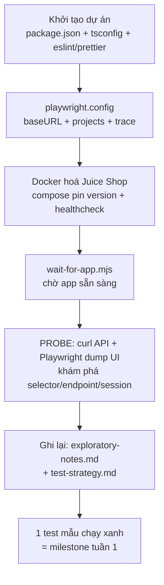

# Tuần 1 — Hiểu từng bước triển khai: Nền móng (Scaffolding + Docker + Probe + Strategy)

> Cùng phong cách week2–week5: mỗi mảnh có **(1) làm gì**, **(2) code thật**, **(3) vì sao**, **(4) không làm vậy thì hỏng gì**. Đọc tuần tự là một hành trình học.

Tuần 1 **chưa viết test nghiệp vụ** — nó dựng **khung xương** để mọi tuần sau đứng lên: khởi tạo dự án (Playwright + TS + lint/format), **Docker hoá** Juice Shop để chạy được offline/CI, **probe (thám thính)** app thật để biết chính xác selector/API/cách lưu session, và viết **chiến lược test**. Cuối tuần: 1 test mẫu chạy xanh against Juice Shop local.

---

## 0. Nguyên tắc vàng: chuẩn bị nền vững, PROBE trước khi code

Sai lầm phổ biến của người mới: nhảy vào viết test ngay. Juice Shop đầy "bẫy" (endpoint số nhiều lạ, id động, cách lưu token khác thường). Tuần 1 đặt ra kỷ luật cho cả dự án: **dựng môi trường tái lập được (Docker) → thám thính sự thật (probe) → ghi lại (docs) → rồi mới build.**



---

## 1. Kiến trúc: tuần 1 dựng "khung xương"

| Thành phần      | File                                                 | Vai trò                                           |
| --------------- | ---------------------------------------------------- | ------------------------------------------------- |
| Quản lý dự án   | `package.json`                                       | scripts (`app:up`, `test`, `lint`…), dependencies |
| Biên dịch TS    | `tsconfig.json`                                      | strict mode, ESM, path                            |
| Cấu hình test   | `playwright.config.ts`                               | baseURL, projects, retries, trace                 |
| Chất lượng code | `eslint.config.mjs`, `.prettierrc.json`              | lint + format                                     |
| Môi trường      | `docker-compose.yml`                                 | dựng Juice Shop (pin version)                     |
| Cổng sẵn sàng   | `scripts/wait-for-app.mjs`                           | chờ app trả 200                                   |
| Tài liệu        | `docs/test-strategy.md`, `docs/exploratory-notes.md` | chiến lược + sự thật đã probe                     |

---

## 2. Bước 1 — Khởi tạo dự án

**Làm gì:** tạo project Playwright + TypeScript, cấu trúc thư mục `src/` (pages/api/fixtures/data/utils) và `tests/`, thêm ESLint + Prettier.

**`package.json` — script hoá mọi thao tác:**

```json
"scripts": {
  "app:up": "docker compose up -d",
  "app:wait": "node scripts/wait-for-app.mjs",
  "test": "playwright test",
  "test:smoke": "playwright test --grep @smoke",
  "lint": "eslint .",
  "format": "prettier --write .",
  "typecheck": "tsc --noEmit"
}
```

**Vì sao:** mọi thao tác (dựng app, chạy test, lint) thành **một lệnh** → tái lập được ở máy khác và trong CI y hệt. `"type": "module"` (ESM) để đồng bộ với Playwright hiện đại.

**`tsconfig.json`** dùng `strict: true`, `noUnusedLocals/Parameters` → bắt lỗi sớm ngay lúc gõ.

**ESLint (flat config) + Prettier + `eslint-plugin-playwright`** → chuẩn hoá code + bắt anti-pattern Playwright (vd quên `await`).

**Nếu không làm vậy:** mỗi người chạy một kiểu, code lệch style, lỗi TS lọt tới lúc chạy mới phát hiện.

---

## 3. Bước 2 — Docker hoá Juice Shop (điểm then chốt của tuần 1)

> 📘 Chưa quen Docker? Đọc kèm [docs/setup/docker.md](../setup/docker.md) — giải thích image/container, từng dòng `docker-compose.yml`, healthcheck, lệnh, và xử lý sự cố cho người mới.

**Làm gì:** dựng Juice Shop bằng Docker để chạy được **offline và trong CI**, không phụ thuộc site public.

**`docker-compose.yml`:**

```yaml
services:
  juice-shop:
    image: bkimminich/juice-shop:v17.1.1 # PIN version
    ports: ['3000:3000']
    environment:
      - NODE_ENV=unsafe # giữ tất cả challenge BẬT
    healthcheck:
      test: [
          'CMD',
          '/nodejs/bin/node',
          '-e',
          "require('http').get('http://localhost:3000/rest/admin/application-version',
          r => process.exit(r.statusCode === 200 ? 0 : 1)).on('error', () => process.exit(1))",
        ]
      interval: 10s
      timeout: 5s
      retries: 12
      start_period: 20s
```

**Vì sao pin `v17.1.1`:** một bản upstream mới **không thể âm thầm** làm vỡ test (đổi selector/endpoint). Nâng cấp phải có chủ đích rồi chạy lại regression.

> 🐞 **Bẫy distroless (phát hiện khi probe healthcheck):** image Juice Shop là **distroless** — không có shell, không `curl`/`wget`, và `node` **không nằm trên `$PATH`**. Nó ở đường dẫn tuyệt đối **`/nodejs/bin/node`**. Một healthcheck kiểu `curl` hay `node ...` (không path đầy đủ) sẽ **âm thầm fail** (container "unhealthy" mãi). Đây là lý do probe đầu tiên là _probe chính cái healthcheck_.

**Nếu không làm vậy:** test phụ thuộc site online (chậm, đổi data, không chạy CI được); container "up" nhưng chưa "ready" → race.

---

## 4. Bước 3 — `wait-for-app.mjs` + `playwright.config` chi tiết

### 4.1 Cổng sẵn sàng huống caller

**`scripts/wait-for-app.mjs`** poll `GET /rest/admin/application-version` mỗi 3s cho tới khi nhận `200` (timeout 120s), rồi `exit 0`. Chỉ dùng `node:http`, không phụ thuộc.

**Vì sao:** `docker compose up -d` trả về khi container _đã lên_, nhưng SPA cần thêm thời gian mới _phục vụ được request_. Không có cổng này → test khởi động vào app "nguội" → fail giả.

### 4.2 `playwright.config.ts` — quyết định nền tảng

```ts
const BASE_URL = process.env.BASE_URL ?? 'http://localhost:3000';
const IS_CI = !!process.env.CI;
export default defineConfig({
  fullyParallel: true,
  retries: IS_CI ? 2 : 1,
  workers: IS_CI ? 2 : 4, // cap vì Juice Shop là 1 container SQLite
  timeout: 45_000,
  use: {
    baseURL: BASE_URL,
    trace: 'on-first-retry', // đòn bẩy debug flaky
    screenshot: 'only-on-failure',
    video: 'retain-on-failure',
    testIdAttribute: 'data-test',
  },
  projects: [{ name: 'chromium' }, { name: 'firefox' }, { name: 'webkit' }],
});
```

**Vì sao từng thứ (điểm phỏng vấn):**

- `baseURL` tập trung → đổi local/CI/staging chỉ một env var.
- `workers` cap → 1 container SQLite không bị quá tải (nguồn timeout giả).
- `trace: on-first-retry` → không tốn overhead khi pass, có full timeline khi flaky.
- `projects` (3 engine) → cùng config phục vụ nhiều ngữ cảnh CI (chi tiết tuần 5).

> Một số giá trị (retries, `workers`, `navigationTimeout`, allure reporter) được tinh chỉnh ở tuần 4–5; đây là bản đã hoàn thiện.

---

## 5. Bước 4 — EXPLORATORY PROBE (đặc trưng của tuần 1)

Đây là phần "khám phá sự thật" — nền cho **mọi** selector/endpoint ở các tuần sau. Dùng 2 công cụ: `curl` (API) và Playwright headless (UI dump), chạy file tạm rồi **xoá**.

**Cách probe UI (rút gọn) — dump storage sau khi login để biết app lưu session ở đâu:**

```js
// login qua UI form rồi soi storage
const storage = await page.evaluate(() => ({
  local: Object.keys(localStorage),
  session: Object.fromEntries(Object.entries(sessionStorage)),
}));
console.log(storage); // -> local: ['token'], session: { bid: '...' }
console.log(await context.cookies()); // -> có cookie 'token', 'welcomebanner_status'...
```

**Những sự thật quan trọng thu được** (ghi vào `docs/exploratory-notes.md`):

| Phát hiện                                                                                         | Ý nghĩa cho framework                                                                          |
| ------------------------------------------------------------------------------------------------- | ---------------------------------------------------------------------------------------------- |
| JWT lưu ở **cả** `localStorage['token']` **và** cookie `token`                                    | Muốn "đăng nhập sẵn" phải seed cả hai                                                          |
| Basket id ở `sessionStorage['bid']`                                                               | `sessionStorage` **không** được `storageState` lưu → phải inject bằng `addInitScript` (tuần 2) |
| Cookie `welcomebanner_status=dismiss` + `cookieconsent_status=dismiss` tắt overlay                | Set sẵn → không test nào tốn thời gian click banner                                            |
| `POST /api/Users` **không** lưu security answer → phải `POST /api/SecurityAnswers`                | Quyết định cách `AuthApi.register` (tuần 2)                                                    |
| Selector thật: `#email/#password/#loginButton`, product `mat-grid-tile`, giá `.item-price` (`¤`)… | Nền cho POM tuần 2–3                                                                           |

**Vì sao bước này quan trọng nhất tuần 1:** nếu đoán mò, POM/API sẽ sai và test đỏ vì lý do sai. Probe biến giả định thành **sự thật đã kiểm chứng**, mã hoá vào `src/data/constants.ts` để chỉ sửa một nơi khi app đổi.

---

## 6. Bước 5 — Tài liệu tư duy

**Làm gì:** viết `docs/test-strategy.md` (scope, ưu tiên theo rủi ro, cái gì automate/cái gì không, Q&A phỏng vấn) và `docs/exploratory-notes.md` (bảng selector/endpoint/quirk đã probe).

**Vì sao:** với vị trí QA, **tư duy chiến lược** quan trọng ngang code. Tài liệu này (a) hướng dẫn chính mình khi build, (b) là bằng chứng "làm QA có kỷ luật" cho nhà tuyển dụng, (c) là "kịch bản" trả lời phỏng vấn.

Một quyết định chiến lược cốt lõi ghi trong strategy: **verification qua API-level state check** thay vì query DB (SQLite nhúng không truy cập ngoài được) — đây là gốc của pattern "UI action → API verify" ở tuần 3.

---

## 7. Bước 6 — Test mẫu (milestone tuần 1)

**Làm gì:** một smoke test đơn giản chứng minh toàn bộ chuỗi (Docker → config → Playwright → app) hoạt động, vd catalog load được:

```ts
test('catalog renders', async ({ page }) => {
  await page.goto('/#/search');
  expect(await page.locator('mat-grid-tile').count()).toBeGreaterThan(0);
});
```

**Vì sao:** milestone tuần 1 không phải "nhiều test" mà là **"đường ống chạy được"**: `npm run app:up && npm run app:wait && npm test` cho ra 1 test xanh against Juice Shop local. Có đường ống rồi thì tuần 2–3 chỉ việc "đổ" test vào.

---

## 8. Tự kiểm tra hiểu bài

1. Vì sao pin `image: ...v17.1.1` thay vì `latest`? _(upstream không thể âm thầm làm vỡ test)_
2. Healthcheck vì sao gọi `/nodejs/bin/node` chứ không `node`/`curl`? _(image distroless, node không trên PATH, không có curl)_
3. `docker compose up -d` xong có chạy test ngay được không? Vì sao cần `wait-for-app`? _(container up ≠ app ready)_
4. Vì sao probe TRƯỚC khi viết POM? _(biến giả định thành sự thật; selector/endpoint Juice Shop không đoán được)_
5. App lưu JWT và basket id ở đâu? _(localStorage+cookie `token`; sessionStorage `bid`)_
6. Vì sao verification dùng API-level check thay vì query DB? _(SQLite nhúng không truy cập từ ngoài)_

---

## 9. Tổng kết & bài học

### File tạo ra

`package.json`, `tsconfig.json`, `playwright.config.ts`, `eslint.config.mjs`, `.prettierrc.json`, `docker-compose.yml`, `scripts/wait-for-app.mjs`, `docs/test-strategy.md`, `docs/exploratory-notes.md`, cấu trúc `src/` + `tests/`.

### Milestone

`npm run app:up && npm run app:wait && npm test` → 1 test xanh against Juice Shop local.

### 4 bài học cốt lõi

1. **Môi trường tái lập được là nền của mọi thứ** — Docker pin version + healthcheck + wait-for-app.
2. **Probe trước, code sau** — sự thật đã kiểm chứng đắt hơn giả định.
3. **Script hoá mọi thao tác** — một lệnh chạy giống nhau ở mọi máy/CI.
4. **Tài liệu chiến lược là một phần sản phẩm** — nhất là cho vị trí QA.
