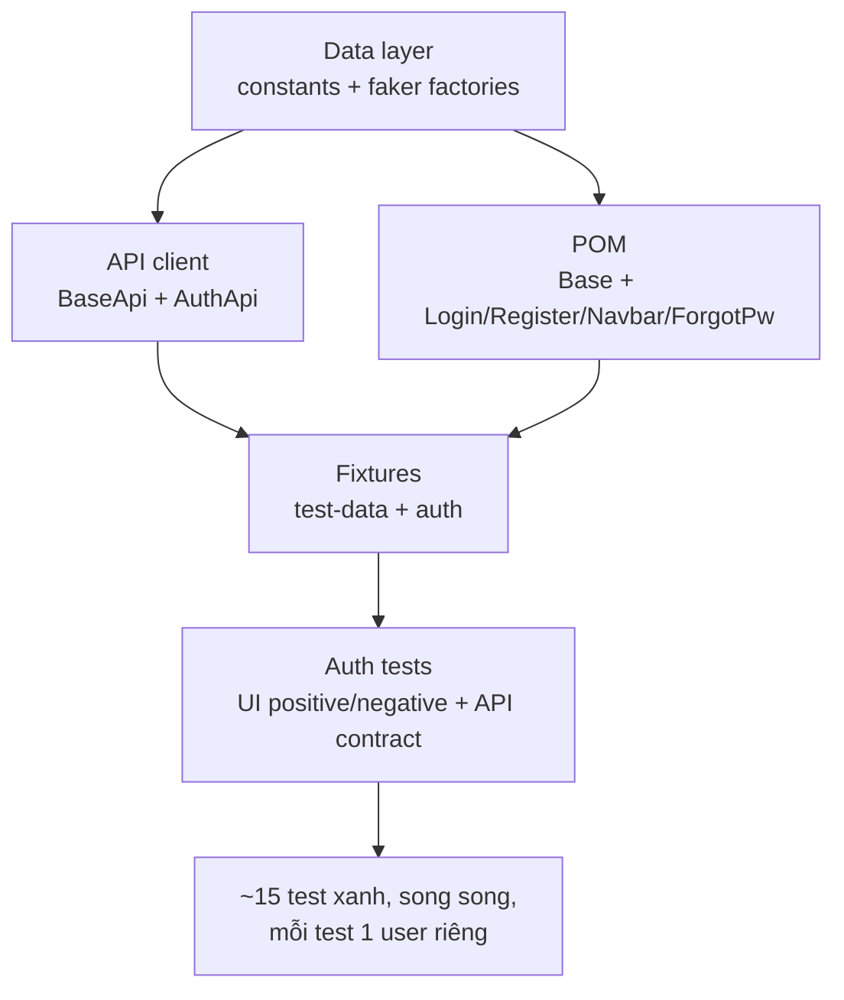

# Tuần 2 — Hiểu từng bước triển khai: Auth + POM + Fixtures + Data factory

> Cùng phong cách week1/week3–week5: mỗi mảnh có **(1) làm gì**, **(2) code thật**, **(3) vì sao**, **(4) không làm vậy thì hỏng gì**.

Tuần 2 dựng **bộ khung tái dùng** cho mọi test về sau: tầng dữ liệu (faker factory), **Page Object Model** (base + login/register/navbar/forgot-password), **API client** (đăng ký/đăng nhập qua HTTP), và **fixtures** — trái tim của framework (API-first auth + `storageState` injection). Cuối tuần: ~15 test Auth xanh, chạy song song, mỗi test tự sinh user riêng.

---

## 0. Nguyên tắc: tách lớp để test "đọc như đặc tả"

Mục tiêu là mỗi test đọc như một câu nghiệp vụ, không phải "selector soup". Muốn vậy phải tách 4 lớp: **data (sinh dữ liệu) → API client (setup nhanh) → POM (thao tác UI) → fixtures (lắp ráp & tiêm phụ thuộc)**. Xây từ dưới lên.



---

## 1. Bước 1 — Data layer: dữ liệu tươi cho mỗi test

**Làm gì:** `src/data/constants.ts` (routes/storage keys/security question), `src/data/types.ts`, và các faker factory.

**`makeUser()` — mỗi test một user duy nhất:**

```ts
export function makeUser(overrides: Partial<TestUser> = {}): TestUser {
  const unique = `${Date.now().toString(36)}.${faker.string.alphanumeric(8).toLowerCase()}`;
  return {
    email: `qa.${unique}@e2e.local`, // timestamp + random -> không bao giờ trùng
    password: `Pw!${faker.string.alphanumeric(9)}`, // 12 ký tự, trong rule 5–40
    securityQuestionId: SECURITY_QUESTION.id,
    securityAnswer: faker.person.lastName(),
    ...overrides, // negative test ghim 1 field, còn lại random
  };
}
```

**Vì sao — mỗi test 1 user:** vì không có state chia sẻ, toàn bộ suite chạy **fully parallel an toàn**, không cleanup, không "test A logout test B". Email unique = `Date.now()` (monotonic) + 8 random (chống trùng trong cùng millisec khi nhiều worker).

**Nếu không làm vậy:** dùng user cố định → chạy song song đụng nhau, hoặc đăng ký trùng email → đỏ ngẫu nhiên.

---

## 2. Bước 2 — POM: biến UI thành hành động nghiệp vụ

### 2.1 BasePage — xương sống dùng chung

```ts
export abstract class BasePage {
  constructor(protected readonly page: Page) {}
  async open(path: string) {
    await this.page.goto(path, { waitUntil: 'domcontentloaded' });
    await this.dismissOverlays();
  }
  async dismissOverlays() {
    /* best-effort đóng banner, nuốt mọi lỗi */
  }
}
```

`abstract` = không khởi tạo trực tiếp. `open()` gộp navigate + dọn overlay (hai việc luôn đi cùng nhau). `dismissOverlays` best-effort (`.catch(() => {})`) — không bao giờ throw. _(waitUntil `domcontentloaded` được tinh chỉnh ở tuần 4 cho ổn định dưới tải.)_

### 2.2 Page object vs Component object

- **Page object** (extends BasePage, có `goto()`): `LoginPage`, `RegisterPage`, `ForgotPasswordPage` — màn hình bạn _điều hướng tới_.
- **Component object** (plain class, compose vào page): `NavbarComponent` — widget xuất hiện _trên mọi trang_ (quan hệ has-a, không kế thừa).

```ts
// LoginPage: method đọc như nghiệp vụ, KHÔNG tự assert (để test quyết định kỳ vọng)
async login(email: string, password: string) {
  await this.emailInput.fill(email);
  await this.passwordInput.fill(password);
  await this.loginButton.click();
}
```

### 2.3 Hai mẹo selector rút ra từ probe (điểm "vì sao")

**RegisterPage — retry mở `mat-select`** (Angular Material overlay đôi khi không mở ở click đầu khi tải nặng):

```ts
async selectSecurityQuestion(questionText: string) {
  const option = this.page.locator('mat-option', { hasText: questionText }).first();
  for (let attempt = 0; attempt < 3; attempt++) {
    await this.securityQuestionSelect.click();
    try { await option.waitFor({ state: 'visible', timeout: 3000 }); break; }
    catch { await this.page.keyboard.press('Escape').catch(() => {}); }  // đóng rồi thử lại
  }
  await option.click();
}
```

**ForgotPasswordPage — gõ phím thật** (câu hỏi bảo mật load theo `valueChanges` có debounce; `fill()` không kích hoat):

```ts
async enterEmail(email: string) {
  await this.emailInput.click();
  await this.emailInput.pressSequentially(email, { delay: 15 }); // gõ từng ký tự -> fire debounce
  await this.emailInput.blur();
  await this.securityAnswerInput.waitFor({ state: 'visible' });   // field bật khi lookup xong
}
```

**Vì sao:** đây là hai bug thật phát hiện khi chạy — sửa ở POM một chỗ, mọi test hưởng lợi. Bài học: chờ đúng trạng thái đích + retry, không `sleep`.

---

## 3. Bước 3 — API client: nền cho setup nhanh & verify

**`BaseApi`** bọc `APIRequestContext`, lo token + header:

```ts
export class BaseApi {
  constructor(
    protected readonly request: APIRequestContext,
    protected token?: string
  ) {}
  setToken(token?: string): this {
    this.token = token;
    return this;
  } // chainable
  protected headers(extra = {}) {
    return {
      'Content-Type': 'application/json',
      ...(this.token ? { Authorization: `Bearer ${this.token}` } : {}),
      ...extra,
    };
  }
  protected httpPost(url, data) {
    return this.request.post(url, { headers: this.headers(), data });
  }
}
```

**`AuthApi.register` — gọi HAI lần** (mirror UI thật):

```ts
async register(user: TestUser): Promise<APIResponse> {
  const res = await this.httpPost(ENDPOINTS.users, { email, password, passwordRepeat, securityQuestion: {id}, securityAnswer });
  if (res.ok()) {
    const userId = (await res.json())?.data?.id;
    if (userId) {
      // /api/Users KHÔNG lưu security answer -> phải tạo association riêng (phát hiện khi probe)
      await this.httpPost(ENDPOINTS.securityAnswers, { UserId: userId, SecurityQuestionId: user.securityQuestionId, answer: user.securityAnswer });
    }
  }
  return res;   // trả raw để negative test assert status
}
```

`createAndLogin(user)` = register → login → `zod`-parse response → `setToken` → trả `{ token, bid, email }`. Ném lỗi nếu non-2xx.

**Vì sao:** client giấu chi tiết HTTP; test chỉ gọi `authApi.createAndLogin(user)`. `zod` biến "200 nhưng body sai" thành lỗi đọc-được-ngay.

---

## 4. Bước 4 — FIXTURES (trái tim của framework)

Fixtures soạn thành **2 layer** bằng `extend()`; mỗi test chỉ khai báo fixture nó cần, Playwright tự dựng (lazy) và teardown ngược.

### 4.1 Layer 1 — `test-data.fixture.ts`: page sạch + data tươi

```ts
export const test = base.extend<DataFixtures>({
  page: async ({ page, context }, use) => {
    await context.addCookies(DISMISS_COOKIES.map((c) => ({ ...c, url: env.baseURL }))); // tắt banner
    await use(page);
  },
  user: async ({}, use) => {
    await use(makeUser());
  }, // mỗi test 1 user
  address: async ({}, use) => {
    await use(makeAddress());
  },
  card: async ({}, use) => {
    await use(makeCard());
  },
});
```

Override chính fixture `page` để **mọi test** tự động không dính banner.

### 4.2 Layer 2 — `auth.fixture.ts`: API-first auth + `storageState` injection

```ts
export const test = dataTest.extend<AuthFixtures>({
  authApi: async ({ request }, use) => {
    await use(new AuthApi(request));
  },
  // register + login qua API -> nhanh, không flaky
  session: async ({ authApi, user }, use) => {
    await use(await authApi.createAndLogin(user));
  },
  // page đã đăng nhập sẵn, KHÔNG chạy form login
  loggedInPage: async ({ browser, session }, use) => {
    const context = await browser.newContext();
    await context.addCookies([
      ...dismiss,
      { name: 'token', value: session.token, url: env.baseURL },
    ]);
    await context.addInitScript(
      ([t, b]) => {
        localStorage.setItem('token', t);
        sessionStorage.setItem('bid', b); // sessionStorage KHÔNG được storageState lưu -> phải addInitScript
      },
      [session.token, String(session.bid)]
    );
    const page = await context.newPage();
    await use(page);
    await context.close();
  },
});
```

**Vì sao (điểm phỏng vấn):**

- **Fixture vs `beforeEach`?** Fixture lazy (chỉ tốn khi test khai báo), compose được thành chuỗi, type-safe, không state chia sẻ. `beforeEach` chạy vô điều kiện, khó compose.
- **Vì sao login qua API?** Nhanh hơn nhiều & ít flaky hơn drive form; UI login vẫn được test riêng. Token/`bid` bắt từ login rồi tiêm vào storage → UI mở ra là đã đăng nhập.
- **Vì sao `sessionStorage.bid` phải `addInitScript`?** Playwright `storageState` chỉ lưu cookie + localStorage, **không** sessionStorage → phải chạy script trước khi app boot.

**Nếu không làm vậy:** mọi test UI phải drive form login (chậm, flaky); dùng chung 1 storageState file → basket/checkout test đụng nhau.

---

## 5. Bước 5 — Đọc test dòng-by-dòng

**Auth UI (login) — dùng API-first setup:**

```ts
test(
  'a registered user can log in',
  { tag: ['@smoke', '@regression'] },
  async ({ page, authApi, user }) => {
    await authApi.register(user); // (1) setup nhanh qua API
    const login = new LoginPage(page);
    await login.goto();
    await login.loginAs(user); // (2) UI action = thứ đang test
    await login.navbar.openAccountMenu(); // (3) verify: menu account có Logout
    await expect(login.navbar.logoutMenuButton).toBeVisible();
  }
);
```

**Auth API (contract) — status + schema:**

```ts
test(
  'POST /api/Users registers a new user and returns 201',
  { tag: ['@api', '@smoke', '@regression'] },
  async ({ authApi, user }) => {
    const res = await authApi.register(user);
    expect(res.status()).toBe(201);
    const body = RegisterResponseSchema.parse(await res.json()); // zod: sai shape = fail đọc được
    expect(body.data.email).toBe(user.email);
  }
);
```

Bộ test Auth tuần 2 gồm: login (đúng/sai/unknown/nút disable/logout), register (hợp lệ/mismatch/email sai/thiếu security question), forgot-password (reset đúng/sai answer), và Auth API (login 200/401, register 201/duplicate/empty-email, security questions). Negative dùng `overrides` của factory để ghim field xấu.

---

## 6. Bước 6 — Verify (milestone tuần 2)

~15 test Auth (UI + API) xanh, **chạy song song**, mỗi test tự sinh user → không hardcode data, không đụng nhau. Đây là bằng chứng bộ khung (data → API → POM → fixtures) hoạt động; tuần 3 chỉ việc mở rộng sang catalog/basket.

---

## 7. Tự kiểm tra hiểu bài

1. Vì sao mỗi test một user riêng? _(parallel-safe, không state chia sẻ)_
2. Page object khác Component object thế nào? _(page có goto/điều hướng tới; component compose vào — navbar)_
3. Vì sao `LoginPage.login()` không tự assert? _(để positive & negative test tái dùng, tự quyết kỳ vọng)_
4. Vì sao `AuthApi.register` gọi 2 lần? _(/api/Users không lưu security answer -> +/api/SecurityAnswers)_
5. Fixture hơn `beforeEach` ở điểm nào? _(lazy, compose, type-safe, không shared state)_
6. Vì sao `bid` phải inject bằng `addInitScript` chứ không qua storageState? _(storageState không lưu sessionStorage)_
7. `pressSequentially` giải quyết vấn đề gì ở forgot-password? _(fire debounce valueChanges mà fill() không kích hoạt)_

---

## 8. Tổng kết & bài học

### File tạo ra (chính)

`src/data/{constants,types}.ts` + `factories/{user,address,card}.factory.ts`; `src/pages/{base,login,register,navbar,forgot-password}`; `src/api/{base.api,auth.api}.ts` + `schemas.ts`; `src/fixtures/{test-data,auth,index}.ts`; `src/utils/{env,currency,logger}.ts`; `tests/ui/auth/*` + `tests/api/auth.api.spec.ts`.

### 4 bài học cốt lõi

1. **Tách lớp để test đọc như đặc tả** — data/API/POM/fixtures.
2. **API-first + storageState injection** — nhanh, ít flaky, parallel-safe.
3. **Fixtures compose được** — `user → session → loggedInPage`, mỗi tầng tái dùng.
4. **Bug UI sửa ở POM một chỗ** — retry mat-select, pressSequentially; chờ trạng thái, không sleep.
