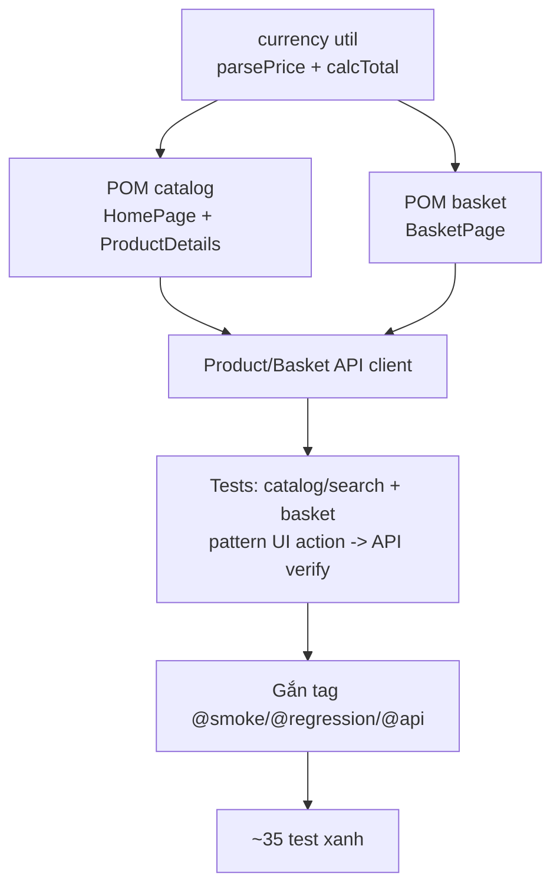

# Tuần 3 — Hiểu từng bước triển khai: Catalog + Basket + "UI→API verify" + Tagging

> Cùng phong cách week1–2/week4–5: mỗi mảnh có **(1) làm gì**, **(2) code thật**, **(3) vì sao**, **(4) không làm vậy thì hỏng gì**.

Tuần 3 mở rộng sang **luồng e-commerce cốt lõi**: catalog/search, product detail, và **basket** (thêm/tăng/giảm/xoá + **tính tổng tiền**). Điểm nhấn tư duy QA: pattern **"UI action → API verify state"** — thao tác trên UI rồi đọc backend qua API để chứng minh hai bên khớp. Cuối tuần: ~35 test, gắn tag `@smoke`/`@regression`/`@api` hoàn chỉnh.

---

## 0. Nguyên tắc: đừng chỉ tin màn hình

Basket là nơi dễ có bug "hiển thị đúng nhưng lưu sai" (hoặc ngược lại). Vì DB là SQLite nhúng (không query từ ngoài), tuần 3 dùng **API làm tầng verify**: drive UI → gọi REST đọc lại state → so khớp. Đây là "phiên bản hiện đại của DB check" cho SPA/API-driven app.



---

## 1. Bước 1 — currency util: xử lý giá tiền thật

**Làm gì:** `src/utils/currency.ts` để đọc giá dạng text (`"1.99¤"`) thành số và tính tổng.

```ts
export function parsePrice(text: string): number {
  // "1.99¤" -> 1.99
  const match = text.replace(',', '.').match(/-?\d+(\.\d+)?/);
  if (!match) throw new Error(`No numeric value in "${text}"`);
  return Number(match[0]);
}
export function roundMoney(v: number): number {
  // giết float noise
  return Math.round((v + Number.EPSILON) * 100) / 100;
}
export function calcTotal(items: { price: number; quantity: number }[]): number {
  return roundMoney(items.reduce((s, i) => s + i.price * i.quantity, 0));
}
```

**Vì sao:** app render giá kèm ký hiệu tiền tệ `¤`, và tổng đôi khi lộ **float noise** (`6.970000000000001`). `parsePrice` bóc số; `roundMoney` (cộng `Number.EPSILON` trước khi làm tròn) khử noise. `calcTotal` tái dùng `roundMoney` → một chính sách làm tròn duy nhất toàn dự án.

**Nếu không làm vậy:** assert tổng tiền sẽ đỏ ngẫu nhiên vì `3.98 !== 3.9800000001`.

---

## 2. Bước 2 — POM catalog

### 2.1 HomePage — product card + search

```ts
export class HomePage extends BasePage {
  productCards = page.locator('mat-grid-tile'); // mỗi sản phẩm 1 tile (không phải mọi mat-card)
  productNames = page.locator('.item-name');

  card(name: string): Locator {
    // định vị 1 card theo tên chuẩn hoá
    return this.productCards.filter({ has: this.page.getByText(name, { exact: true }) });
  }
  async addToBasket(name: string) {
    await this.card(name).getByRole('button', { name: 'Add to Basket' }).click();
  }
  async priceOf(name: string) {
    return parsePrice(await this.card(name).locator('.item-price').innerText());
  }
}
```

**Vì sao `mat-grid-tile` chứ không `mat-card`:** probe cho thấy các "challenge solved" cũng là `mat-card` → dùng `mat-grid-tile` mới đúng số sản phẩm. `getByRole('button', { name: 'Add to Basket' })` bền hơn CSS class.

### 2.2 ProductDetailsComponent — modal, không phải route

Product detail mở bằng **dialog** (`mat-dialog-container`), nên là **component object** (không có `goto()`), child locator scope trong `this.dialog` để không khớp nhầm element sau modal. Đóng bằng `Escape`.

---

## 3. Bước 3 — POM basket (logic e-commerce quan trọng)

```ts
export class BasketPage extends BasePage {
  rows = page.locator('mat-row');
  totalPriceLabel = page.locator('#price');

  row(name: string): Locator {
    // lọc HÀNG theo tên sản phẩm
    return this.rows.filter({
      has: this.page.locator('mat-cell.mat-column-product', { hasText: name }),
    });
  }
  quantityCell(name: string): Locator {
    // trả Locator để test dùng web-first toHaveText
    return this.row(name).locator('mat-cell.mat-column-quantity');
  }
  async increaseQuantity(name: string) {
    // ô quantity có 2 nút [−, +]
    await this.row(name).locator('mat-cell.mat-column-quantity button').nth(1).click(); // nth(1)=tăng
  }
  async decreaseQuantity(name: string) {
    await this.row(name).locator('mat-cell.mat-column-quantity button').nth(0).click(); // nth(0)=giảm
  }
  async unitPriceOf(name: string) {
    return parsePrice(await this.row(name).locator('mat-cell.mat-column-price').innerText());
  }
  async totalPrice() {
    return parsePrice(await this.totalPriceLabel.innerText());
  } // "Total Price: 6.97¤"
}
```

**Vì sao `nth(0)`/`nth(1)`:** probe xác nhận ô quantity chứa đúng 2 icon-button theo thứ tự **[giảm, tăng]** (không có aria-label), nên định vị theo vị trí là cách xác định nhất. `quantityCell()` trả **Locator thô** để test dùng `await expect(...).toHaveText('2')` (web-first, tự retry) thay vì đọc-một-phát.

---

## 4. Bước 4 — API client cho product & basket

```ts
// ProductApi
async list(): Promise<Product[]> {
  return ProductListResponseSchema.parse(await (await this.listRaw()).json()).data;
}
async search(query: string): Promise<Product[]> { /* GET /rest/products/search?q= */ }

// BasketApi — vừa SEED nhanh vừa VERIFY
addItemRaw(basketId, productId, quantity = 1) {
  return this.httpPost(ENDPOINTS.basketItems, { ProductId: productId, BasketId: String(basketId), quantity });
}
async quantityOf(basketId, productId): Promise<number> {   // dùng để VERIFY sau UI action
  const basket = await this.get(basketId);
  return basket.Products.find((p) => p.id === productId)?.BasketItem.quantity ?? 0;
}
```

**Vì sao:** `BasketApi` đóng hai vai — **seed** (dựng nhanh tiền đề) và **verify** (đọc lại state). `quantityOf` bóc số lượng nằm ở `Products[].BasketItem.quantity` (shape probe được), trả 0 nếu không có → test assert gọn.

---

## 5. Bước 5 — Pattern "UI action → API verify" (đặc trưng tuần 3)

Đọc test basket dòng-by-dòng:

```ts
test(
  'adding a product from the catalog puts it in the basket',
  { tag: ['@smoke', '@regression'] },
  async ({ loggedInPage, session, basketApi }) => {
    basketApi.setToken(session.token); // (0) client dùng token của user này
    const home = new HomePage(loggedInPage);
    await home.goto();

    const name = await home.addFirstProductToBasket(); // (1) UI ACTION: bấm "Add to Basket" thật

    // (2) API VERIFY: đọc backend basket, retry cho eventual consistency
    await expect
      .poll(async () => (await basketApi.get(session.bid)).Products.map((p) => p.name))
      .toContain(name);

    // (3) Cross-check UI: hàng hiện trong trang basket
    const basket = new BasketPage(loggedInPage);
    await basket.goto();
    await expect(basket.row(name)).toBeVisible();
  }
);
```

Test tính tổng tiền (data-driven từ giá thật):

```ts
test(
  'the basket total equals the sum of line prices',
  { tag: ['@smoke', '@regression'] },
  async ({ loggedInPage, session, basketApi }) => {
    basketApi.setToken(session.token);
    await basketApi.addItemRaw(session.bid, APPLE.id, 2); // seed nhanh 2 apple
    await basketApi.addItemRaw(session.bid, ORANGE.id, 1);
    const basket = new BasketPage(loggedInPage);
    await basket.goto();
    const lines = [
      {
        price: await basket.unitPriceOf(APPLE.name),
        quantity: await basket.quantityOf(APPLE.name),
      },
      {
        price: await basket.unitPriceOf(ORANGE.name),
        quantity: await basket.quantityOf(ORANGE.name),
      },
    ];
    expect(await basket.totalPrice()).toBeCloseTo(calcTotal(lines), 2); // toBeCloseTo khử float noise
  }
);
```

**Vì sao pattern này giá trị:** UI-only có thể "hiển thị đúng" dù backend sai (và ngược lại). Đọc lại qua API bắt được lớp bug mà assert một-phía bỏ lỡ — đúng tư duy QA. `expect.poll` chờ backend nhất quán (không `sleep`); `toBeCloseTo(_, 2)` nuốt float noise.

Bộ test basket tuần 3: add (UI→API verify), tăng/giảm số lượng, xoá, **tổng tiền = Σ(giá×SL)**, giữ giỏ sau reload, add cùng sản phẩm 2 lần → tăng SL (không tạo dòng mới). Catalog/search: render, giá hợp lệ, pagination, mở product detail; search có/không kết quả.

---

## 6. Bước 6 — Tagging: một suite phục vụ nhiều ngữ cảnh

**Làm gì:** gắn tag inline cho từng test.

```ts
test('...', { tag: ['@smoke', '@regression'] }, async () => { ... });
```

- `@smoke` — subset "store còn hoạt động không?" (chạy mỗi push).
- `@regression` — mọi test (chạy nightly).
- `@api` — test tầng HTTP.

CI chọn suite bằng `--grep`: `--grep @smoke` cho push nhanh; `--grep @regression` cho nightly. **Vì sao:** tag tách "test nói về cái gì" khỏi "khi nào CI chạy nó" → một suite phẳng phục vụ nhiều ngữ cảnh mà không nhân đôi spec. (Đây là nền để tuần 4–5 dựng smoke.yml + nightly.)

---

## 7. Tự kiểm tra hiểu bài

1. Vì sao product card dùng `mat-grid-tile` chứ không `mat-card`? _(mat-card còn là card "challenge solved")_
2. `parsePrice` + `toBeCloseTo` giải quyết vấn đề gì? _(ký hiệu ¤ + float noise 6.9700001)_
3. Nút tăng/giảm số lượng định vị bằng gì, vì sao? _(nth(0)/nth(1) — 2 icon-button không aria-label, theo vị trí)_
4. "UI action → API verify" là gì và bắt lỗi gì UI-only bỏ lỡ? _(drive UI rồi đọc backend; bắt sai state dù màn hình đúng)_
5. Vì sao verify dùng `expect.poll`? _(chờ eventual consistency giữa click và backend, không sleep)_
6. Tag để làm gì? _(tách "test về gì" khỏi "khi nào chạy"; CI --grep chọn suite)_

---

## 8. Tổng kết & bài học

### File tạo ra (chính)

`src/utils/currency.ts`; `src/pages/{home,product-details,basket}`; `src/api/{product.api,basket.api}.ts` (+ schema); `tests/ui/catalog/*`, `tests/ui/basket/*`, `tests/api/{products,basket}.api.spec.ts`.

### Milestone

~35 test xanh, tagging `@smoke`/`@regression`/`@api` hoàn chỉnh, chạy song song.

### 4 bài học cốt lõi

1. **Đừng chỉ tin UI** — "UI action → API verify" bắt bug hai-phía.
2. **Tiền tệ cần xử lý tử tế** — parse + làm tròn một chính sách, `toBeCloseTo`.
3. **Selector theo cấu trúc đã probe** — `mat-grid-tile`, `nth(0/1)`, cột `mat-column-*`.
4. **Tag hoá sớm** — một suite phục vụ nhiều ngữ cảnh CI về sau.
