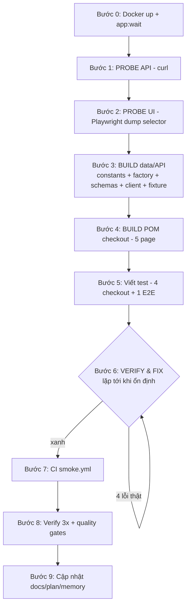

# Tuần 4 — Hiểu từng bước triển khai: Checkout + E2E + CI

> Tài liệu này viết để **bạn hiểu project**, không phải để liệt kê. Với mỗi mảnh, bạn sẽ thấy: **(1) làm gì**, **(2) code thật trông ra sao**, **(3) vì sao làm vậy**, và **(4) nếu không làm vậy thì hỏng gì**. Đọc tuần tự từ trên xuống là một hành trình học.

Tuần 4 thêm 3 thứ vào framework: luồng **Checkout** (địa chỉ → giao hàng → thanh toán → đặt hàng), một kịch bản **E2E** hoàn chỉnh (khách vãng lai → mua xong), và một **pipeline CI smoke**. Kết quả: 47 → **52 test**, đều xanh ổn định.

---

## 0. Nguyên tắc vàng của cả tuần: PROBE → BUILD → VERIFY

Trước khi đọc chi tiết, hãy nắm tư duy xuyên suốt:

1. **PROBE (khám phá sự thật):** gọi thẳng API/UI thật để biết chính xác endpoint, payload, selector, quirk. **Không đoán.**
2. **BUILD (xây theo sự thật):** đóng gói sự thật vào `constants`, rồi xây tầng data/API → POM → test.
3. **VERIFY (chạy & sửa lặp):** chạy test, lỗi thì probe lại, sửa, chạy lại đến khi xanh 3 lần liên tiếp.

Vì sao quan trọng? Juice Shop đầy "bẫy" không thể đoán: endpoint `/api/Addresss` (ba chữ `s`), thẻ bắt `expYear >= 2080`, ô input có id động `mat-input-N`, nút "Continue" có nhãn lệch pha. Đoán mò rồi code = test đỏ vì lý do sai, mất hàng giờ debug nhầm chỗ.



---

## 1. Kiến trúc: các mảnh ghép, và một test đi qua đâu

Trước khi vào chi tiết, đây là **mô hình tư duy**. Một test checkout chạm 4 tầng:

```
FIXTURE          →  cấp sẵn: loggedInPage (đã đăng nhập), session (token+bid),
(tiêm phụ thuộc)     và các API client (addressApi/cardApi/orderApi/basketApi)

API CLIENT       →  (a) SEED nhanh tiền đề: tạo giỏ + địa chỉ + thẻ qua HTTP
(src/api/*)          (b) VERIFY: đọc lại order để đối chiếu

POM              →  drive UI thật: chọn địa chỉ → giao hàng → thẻ → đặt hàng
(src/pages/checkout/)

APP              →  OWASP Juice Shop (Docker :3000)
```

**Ý tưởng cốt lõi (nhớ cái này là hiểu 80% Tuần 4):**

> Cái gì **chậm/dễ vỡ mà không phải thứ đang test** thì **seed qua API**. Cái gì **đang test** thì **drive qua UI**. Xong thì **đọc lại qua API để xác minh** backend thật sự đúng, không chỉ tin màn hình.

Ví dụ: test "đặt hàng thành công" không đi đăng ký/đăng nhập/thêm giỏ/nhập thẻ bằng tay (chậm, flaky) — nó seed hết bằng API, chỉ bấm qua các bước checkout trên UI, rồi gọi `orderApi` đọc lịch sử đơn để chắc chắn đơn đã ghi đúng.

---

## 2. Bước 0 — Chuẩn bị môi trường

> 📘 Chi tiết Docker (image/container, compose, healthcheck, lệnh, sự cố): [docs/setup/docker.md](../setup/docker.md).

**Làm gì:** Docker Desktop đã tắt (phiên mới) → bật lại → `docker compose up -d` dựng Juice Shop → `npm run app:wait` chờ app sẵn sàng.

**Vì sao:** `docker compose up -d` trả về ngay khi container _đã lên_, nhưng SPA cần thêm thời gian mới _phục vụ được request_. Bắt đầu probe/test ngay lúc đó sẽ gặp race "container up ≠ app ready". `scripts/wait-for-app.mjs` poll `GET /rest/admin/application-version` mỗi 3s tới khi nhận `200` (timeout 120s).

---

## 3. Bước 1 — PROBE API bằng curl

**Làm gì:** tạo 1 user + token, rồi gọi lần lượt từng endpoint checkout, ghi lại status/payload/response thật.

**Cách probe (rút gọn):**

```bash
# tạo card thử với các năm khác nhau để tìm ngưỡng hợp lệ
for Y in 2027 2080 2099; do
  curl -s -o /dev/null -w "expYear=$Y -> %{http_code}\n" \
    -X POST http://localhost:3000/api/Cards -H "Authorization: Bearer $TOKEN" \
    -H "Content-Type: application/json" \
    -d "{\"fullName\":\"A\",\"cardNum\":\"4111111111111111\",\"expMonth\":5,\"expYear\":$Y}"
done
# Kết quả: 2027 -> 400, 2080 -> 201, 2099 -> 201  ⇒ min ≈ 2080
```

**Sự thật thu được** (mã hoá 1:1 vào `src/data/constants.ts`):

| Endpoint                      | Method   | Payload                                                                        | Response                                       | Bẫy                                       |
| ----------------------------- | -------- | ------------------------------------------------------------------------------ | ---------------------------------------------- | ----------------------------------------- |
| `/api/Addresss`               | POST/GET | `{fullName, mobileNum (number), zipCode, streetAddress, city, state, country}` | `201`, `data.id`                               | **ba chữ `s`**                            |
| `/api/Cards`                  | POST     | `{fullName, cardNum, expMonth, expYear}`                                       | `201`, `data.id` (=paymentId)                  | **`expYear >= 2080`**                     |
| `/api/Deliverys`              | GET      | —                                                                              | One Day `0.99` / Fast `0.50` / Standard `0.00` | số nhiều "Deliverys"                      |
| `/rest/basket/{bid}/checkout` | POST     | `{couponData:null, orderDetails:{paymentId, addressId, deliveryMethodId}}`     | `{orderConfirmation:'<id>'}`                   | **không** có wrapper `{status:'success'}` |
| `/rest/track-order/{orderId}` | GET      | —                                                                              | `{totalPrice, deliveryPrice, products[]}`      | `eta` khi number khi string               |
| `/rest/order-history`         | GET      | —                                                                              | list order cùng shape                          | `totalPrice = subtotal + deliveryPrice`   |

**Vì sao bước này là quan trọng nhất:** mọi dòng code tầng API/POM sau đó đều dựa trên bảng này. Sai một tên endpoint = 404 hàng loạt; không biết `expYear` quirk = test thẻ đỏ mãi không hiểu vì sao.

---

## 4. Bước 2 — PROBE UI bằng Playwright

**Làm gì:** viết script Playwright đi hết luồng UI, `dump` các thuộc tính element ở mỗi chặng rồi **xoá script** (probe là dùng-một-lần).

**Cách probe (rút gọn):**

```js
await page.click('#checkoutButton');
await page.waitForURL(/address/);
console.log(page.url()); // -> /#/address/select
// dump toàn bộ input của form địa chỉ để lấy selector thật
const inputs = await page
  .locator('input,textarea')
  .evaluateAll((els) => els.map((e) => ({ id: e.id, placeholder: e.getAttribute('placeholder') })));
console.log(inputs);
```

**Chuỗi route chốt được:** `basket` → `/#/address/select` → `/#/delivery-method` → `/#/payment/shop` → `/#/order-summary` → `/#/order-completion/:orderId`.

**Ba quyết định thiết kế sinh ra từ probe UI** (đây là phần "tại sao lại làm vậy"):

1. **Form địa chỉ định vị theo `placeholder`, không theo id.** Vì id render động (`mat-input-1`, `mat-input-2`… đổi mỗi lần). Placeholder (`"Please provide a country."`) là văn bản trong template → ổn định. Ngoại lệ: ô street có id thật `#address`.
2. **Nút "Continue" có aria-label lệch một bước** — nhãn nói "payment" nhưng thực tế nhảy sang "delivery". Ta vẫn ghim đúng nhãn thật (dù khó hiểu) và cho `continue()` **chờ đúng URL đích thật**, nên nhãn sai không gây lỗi.
3. **Thẻ seed qua API, UI chỉ chọn radio.** Form thêm thẻ phức tạp + quirk `expYear >= 2080` khiến nhập thẻ qua UI rất dễ vỡ. Quyết định: `POST /api/Cards` để tạo, UI chỉ tick thẻ có sẵn.

---

## 5. Bước 3 — BUILD tầng data/API (kèm code thật)

Có sự thật rồi mới xây, và xây **từ dưới lên**: data → API client → fixture. Đây là nền cho cả seed-nhanh lẫn verify.

### 5.1 Constants — một nơi duy nhất cho sự thật

```ts
// src/data/constants.ts
export const ENDPOINTS = {
  // ... (Juice Shop pluralise kiểu Sequelize: Addresss, Deliverys)
  addresses: '/api/Addresss',
  cards: '/api/Cards',
  deliveries: '/api/Deliverys',
  checkout: (bid: number | string) => `/rest/basket/${bid}/checkout`,
  orderHistory: '/rest/order-history',
  trackOrder: (orderId: string) => `/rest/track-order/${orderId}`,
} as const;

export const MIN_CARD_EXP_YEAR = 2080; // Card model từ chối năm < ~2080
```

**Vì sao:** endpoint "lạ" chỉ sống một chỗ kèm comment. Khi Juice Shop đổi route, sửa một dòng thay vì lùng khắp code. `checkout`/`trackOrder` là hàm để "id-trong-URL" được đóng gói một lần → spec không thể ghép URL sai.

### 5.2 Data factory — dữ liệu random NHƯNG phải qua được validator thật

```ts
// src/data/factories/card.factory.ts
export function makeCard(overrides: Partial<PaymentCard> = {}): PaymentCard {
  return {
    fullName: faker.person.fullName(),
    // 16 số, ép chữ số đầu KHÁC 0: card number lưu dạng integer có `min` validator,
    // số 0 đứng đầu làm ngắn giá trị số -> bị từ chối (400).
    cardNumber: `4${faker.string.numeric(15)}`,
    expiryMonth: faker.number.int({ min: 1, max: 12 }),
    // neo ở >= 2080 vì Card model có `min` validator trên expYear (probe xác nhận).
    expiryYear: MIN_CARD_EXP_YEAR + faker.number.int({ min: 0, max: 15 }),
    ...overrides,
  };
}
```

**Bài học ở đây:** dữ liệu test random rất tốt (mỗi test một thẻ khác nhau, chạy song song an toàn), **nhưng** nó phải luôn hợp lệ với validator của app. Hai ràng buộc `4${...}` và `>= 2080` chính là để mọi thẻ sinh ra đều được app chấp nhận. (Chữ số đầu `0` là lỗi thật đã nổ ở Bước 6 — xem sau.)

### 5.3 API client — pattern "raw vs parsed" + zod

Tất cả client kế thừa `BaseApi`, lớp này lo token + header:

```ts
// src/api/base.api.ts (rút gọn)
export class BaseApi {
  constructor(
    protected readonly request: APIRequestContext,
    protected token?: string
  ) {}
  setToken(token?: string): this {
    this.token = token;
    return this;
  } // chainable
  protected headers(extra = {}) {
    return {
      'Content-Type': 'application/json',
      ...(this.token ? { Authorization: `Bearer ${this.token}` } : {}),
      ...extra,
    };
  }
  protected httpPost(url: string, data: unknown) {
    return this.request.post(url, { headers: this.headers(), data });
  }
  // httpGet / httpPut / httpDelete tương tự
}
```

Mỗi client domain có **hai kiểu method**: `*Raw()` trả `APIResponse` thô (để test assert status/negative) và bản parsed (kiểm `res.ok()` rồi `zod`-parse, trả data đã typed):

```ts
// src/api/address.api.ts
export class AddressApi extends BaseApi {
  createRaw(address: Address) {
    return this.httpPost(ENDPOINTS.addresses, {
      fullName: address.fullName,
      mobileNum: Number(address.mobileNumber), // API cần số, factory cho string -> ép kiểu
      zipCode: address.zipCode,
      streetAddress: address.streetAddress,
      city: address.city,
      state: address.state,
      country: address.country,
    });
  }
  async create(address: Address): Promise<number> {
    // trả về addressId
    const res = await this.createRaw(address);
    if (!res.ok()) throw new Error(`Create address failed (${res.status()})`);
    return AddressResponseSchema.parse(await res.json()).data.id;
  }
}
```

```ts
// src/api/order.api.ts (những method quan trọng)
async checkout(bid, orderDetails): Promise<string> {        // đặt hàng -> orderId
  const res = await this.checkoutRaw(bid, orderDetails);     // POST {couponData, orderDetails}
  if (!res.ok()) throw new Error(`Checkout failed (${res.status()})`);
  return CheckoutResponseSchema.parse(await res.json()).orderConfirmation;
}
async findInHistory(orderId: string): Promise<Order | undefined> {  // dùng để VERIFY
  return (await this.history()).find((o) => o.orderId === orderId);
}
```

**Vì sao có zod?** Một `200` với body sai hình dạng vẫn là bug. `CheckoutResponseSchema.parse(...)` biến "API đổi shape" thành lỗi đọc-được-ngay tại đúng field, đồng thời cho ta object đã có kiểu để dùng tiếp mà không cần ép tay.

**Vì sao `create()` trả thẳng `id`?** Vì id đó (`addressId`, `paymentId`) chính là thứ bước checkout cần. Client giấu hết chi tiết parse, test chỉ việc `const addressId = await addressApi.create(address)`.

### 5.4 Fixture — tiêm client vào test (dependency injection)

```ts
// src/fixtures/auth.fixture.ts
addressApi: async ({ request }, use) => { await use(new AddressApi(request)); },
cardApi:    async ({ request }, use) => { await use(new CardApi(request)); },
orderApi:   async ({ request }, use) => { await use(new OrderApi(request)); },
```

**Vì sao:** test chỉ cần khai báo `{ addressApi }` trong tham số là Playwright tự dựng sẵn, dùng chung `request` (một `APIRequestContext` kế thừa `baseURL`/`proxy`/`extraHTTPHeaders` từ config). Lười khởi tạo (chỉ dựng khi test gọi tên) + không state chia sẻ → song song an toàn. Lưu ý: `request` là API context **độc lập** với trình duyệt (không dùng chung tracing của browser).

---

## 6. Bước 4 — BUILD POM checkout (kèm code thật)

5 page object trong `src/pages/checkout/`, đều `extends BasePage`. Mỗi cái biến selector thành **method đọc như nghiệp vụ**.

### 6.1 AddressPage — ví dụ đầy đủ nhất

```ts
// src/pages/checkout/address.page.ts (rút gọn)
constructor(page: Page) {
  super(page);
  this.addNewAddressButton = page.locator('button[aria-label="Add a new address"]');
  // nhãn nói "payment" nhưng thực chất đi tới delivery — giữ nhãn thật, chờ URL thật
  this.continueButton = page.locator('button[aria-label="Proceed to payment selection"]');
  this.countryInput = page.getByPlaceholder('Please provide a country.'); // id động -> placeholder
  this.streetAddressInput = page.locator('#address');                     // ô này có id thật
  this.submitButton = page.locator('#submitButton');
  // ... name/mobile/zip/city/state cũng theo placeholder
}

async addNewAddress(address: Address) {
  await this.addNewAddressButton.click();
  await this.page.waitForURL(/address\/create/);   // sang form
  await this.fillForm(address);
  await this.submitButton.click();
  await this.page.waitForURL(/address\/select/);    // quay lại danh sách -> địa chỉ mới đã có
}

async continue() {
  await this.continueButton.click();
  await this.page.waitForURL(/delivery-method/);    // chờ ĐÚNG đích thật, bất chấp nhãn nút
}
```

**Điểm học:** `waitForURL` sau mỗi hành động điều hướng = không sleep cứng, và tự "trung hoà" cái nhãn nút gây hiểu lầm.

### 6.2 DeliveryPage — bài học "text ở cell, không ở radio"

```ts
// src/pages/checkout/delivery.page.ts
async selectByName(name: string) {
  // tên method nằm ở một mat-cell trong hàng, KHÔNG nằm trong mat-radio-button
  // -> lọc cả HÀNG theo text rồi mới drill vào radio
  await this.page.locator('mat-row').filter({ hasText: name })
            .locator('mat-radio-button').click();
}
```

**Vì sao viết vậy:** ban đầu mình lọc `mat-radio-button` theo text → **fail** vì radio không chứa chữ. Probe lại cấu trúc `mat-row` mới sửa đúng (đây là Lỗi 1 ở Bước 6).

### 6.3 PaymentPage & OrderConfirmationPage — ngắn nhưng đắt

```ts
// payment.page.ts: thẻ đã seed qua API, chỉ chọn
this.continueButton = page.locator('button[aria-label="Proceed to review"]'); // disabled tới khi chọn thẻ
async selectFirstCard() { await this.cardRadios.first().click(); }

// order-confirmation.page.ts: lấy orderId từ URL để VERIFY
orderId(): string | null {
  const m = this.page.url().match(/order-completion\/([^/?#]+)/);
  return m ? m[1] : null;
}
```

**Vì sao lấy orderId từ URL:** trang xác nhận không có element id ổn định cho mã đơn, nhưng URL `/#/order-completion/<id>` luôn chứa nó → nguồn đáng tin nhất để rồi tra cứu qua API.

---

## 7. Bước 5 — Đọc TEST dòng-by-dòng (phần học quan trọng nhất)

Hiểu một test đầu-đến-cuối là cách nhanh nhất để hiểu cả project. Dưới đây là test "đinh".

### 7.1 Helper `walkToOrder` — 4 bước UI dùng lại

```ts
async function walkToOrder(page, deliveryName): Promise<OrderConfirmationPage> {
  const address = new AddressPage(page);
  await address.gotoSelect();
  await address.selectFirst();
  await address.continue();
  const delivery = new DeliveryPage(page);
  await delivery.selectByName(deliveryName);
  await delivery.continue();
  const payment = new PaymentPage(page);
  await payment.selectFirstCard();
  await payment.continue();
  const summary = new OrderSummaryPage(page);
  await summary.placeOrder();
  return new OrderConfirmationPage(page);
}
```

Ba trong bốn test chỉ khác nhau ở _delivery method_ và _assertion_, nên phần "đi qua UI" được tách ra dùng chung.

### 7.2 Test "Full checkout" — mổ xẻ từng dòng

```ts
test(
  'a user can complete a full checkout and the order is recorded',
  { tag: ['@smoke', '@regression'] },
  async ({ loggedInPage, session, basketApi, addressApi, cardApi, orderApi, address, card }) => {
    // (1) SEED tiền đề qua API — set token cho từng client rồi tạo dữ liệu
    basketApi.setToken(session.token);
    addressApi.setToken(session.token);
    cardApi.setToken(session.token);
    orderApi.setToken(session.token);
    await basketApi.addItemRaw(session.bid, APPLE.id, 2); // 2 chai Apple Juice
    await addressApi.create(address); // 1 địa chỉ
    await cardApi.create(card); // 1 thẻ (expYear>=2080)

    // (2) UI ACTION — bấm qua checkout, chọn Standard (miễn phí) => tổng = 3.98
    const confirmation = await walkToOrder(loggedInPage, DELIVERY.standard);

    // (3) Xác nhận trên UI
    expect(await confirmation.isConfirmed()).toBe(true);
    const orderId = confirmation.orderId();
    expect(orderId).toBeTruthy();

    // (4) API VERIFY — đọc lịch sử đơn, đối chiếu nội dung thật
    const order = await orderApi.findInHistory(orderId!);
    expect(order, 'order should be in history').toBeDefined();
    const appleLine = order!.products.find((p) => p.id === APPLE.id)!;
    expect(appleLine.quantity).toBe(2); // đúng số lượng
    expect(order!.totalPrice).toBeCloseTo(APPLE.price * 2, 2); // đúng tổng tiền
  }
);
```

Hiểu 4 khối này là hiểu toàn bộ triết lý:

- **(1)** mỗi client là instance riêng nên phải `setToken(session.token)` — đây là user do fixture `session` tạo sẵn qua API.
- **(2)** chỉ phần checkout được drive UI (đó là thứ đang test).
- **(3)** UI nói "thành công".
- **(4)** **nhưng ta không tin UI** — đọc order qua API để chắc line qty = 2 và `totalPrice` đúng. `toBeCloseTo(_, 2)` để nuốt nhiễu số thực.

### 7.3 Test E2E — khác gì? "Toàn bộ UI thật"

E2E (`tests/e2e/purchase-journey.spec.ts`) **không** dùng `loggedInPage` (vốn tiêm sẵn đăng nhập). Nó đăng ký + đăng nhập **qua form thật**, rồi:

```ts
// sau khi login qua UI, lấy token+bid từ storage để wire API client + verify
const token = await page.evaluate(() => localStorage.getItem('token'));
const bid = await page.evaluate(() => sessionStorage.getItem('bid'));
basketApi.setToken(token!);
cardApi.setToken(token!);
orderApi.setToken(token!);
await cardApi.create(card); // vẫn seed thẻ qua API (né quirk expYear)

await home.goto();
await home.addToBasket(APPLE.name);
await expect.poll(() => basketApi.quantityOf(bid!, APPLE.id)).toBeGreaterThanOrEqual(1); // chờ backend
await home.navbar.goToBasket(); // tới giỏ bằng nút cart (SPA nav)
// ... rồi checkout qua UI như bình thường, cuối cùng orderApi.findInHistory verify
```

**Vì sao E2E khác:** nó chứng minh **cả hành trình** hoạt động thật (đăng ký thật, đăng nhập thật) — đây là bài demo/GIF cho README. Chỉ thẻ là seed qua API (do quirk). `page.evaluate` để "móc" token/bid ra khỏi trình duyệt vì ở đây không có `session` fixture.

---

## 8. Bước 6 — Học từ 4 LỖI THẬT (Triệu chứng → Nguyên nhân → Cách sửa)

Phần này dạy **phương pháp debug**: lỗi đến từ đâu, cách truy nguyên, và vì sao cách sửa đúng là "sửa gốc" chứ không phải `sleep`.

### Lỗi 1 — `DeliveryPage.selectByName` chọn sai

- **Triệu chứng:** 2 test checkout fail, không chọn được delivery theo tên.
- **Nguyên nhân:** selector lọc text _bên trong_ `mat-radio-button`, nhưng tên method nằm ở `mat-cell` khác cùng hàng.
- **Cách sửa:** lọc cả `mat-row` theo text rồi mới click radio (xem 6.2). **Bài học:** khi filter fail, probe lại cấu trúc DOM thật thay vì đoán.

### Lỗi 2 — E2E race `bid` (giỏ báo có hàng nhưng trang giỏ rỗng)

- **Triệu chứng:** navbar hiện `Your Basket 1` nhưng trang basket rỗng.
- **Nguyên nhân:** ngay sau login UI, `page.goto('/#/basket')` (full reload) chạy đua với `bid` trong sessionStorage.
- **Cách sửa:** tới giỏ bằng **nút cart** (`navbar.goToBasket()`, điều hướng SPA như người dùng thật, không reload) **và** `expect.poll(basketApi.quantityOf...)` để chắc item đã tới backend trước khi checkout. **Bài học:** flake thường là _thời điểm_, sửa bằng chờ-tín-hiệu (poll) + điều hướng đúng cách, không phải `sleep`.

### Lỗi 3 — `cardNum` số 0 đứng đầu (intermittent)

- **Triệu chứng:** thỉnh thoảng 1 test fail: API `Validation min on cardNum failed`.
- **Nguyên nhân:** `faker` đôi khi sinh số thẻ bắt đầu bằng `0`; card lưu dạng integer có `min`, số 0 đầu làm ngắn giá trị → dưới min.
- **Cách sửa:** ép chữ số đầu là `4` trong factory (xem 5.2). **Bài học:** dữ liệu random phải _bất biến hợp lệ_, đừng chạy lại tới khi may mắn xanh.

### Lỗi 4 — `page.goto` timeout khi chạy song song

- **Triệu chứng:** 1 test fail vì điều hướng chờ event `load` bị timeout dưới tải, dù app đã tương tác được.
- **Nguyên nhân:** Juice Shop là SPA vẫn tải asset challenge lâu sau khi interactive → chờ `load` đầy đủ quá lâu khi nhiều worker.
- **Cách sửa:** `BasePage.open()` điều hướng với `waitUntil: 'domcontentloaded'` (POM có web-first wait ngay sau), và nâng `navigationTimeout` lên `30_000` trong config. **Bài học:** SPA không cần chờ `load` đầy đủ; `domcontentloaded` + web-first assert là đủ và nhanh.

---

## 9. Bước 7 — CI smoke.yml

> 📘 Chưa quen CI/GitHub Actions? Đọc kèm [docs/setup/ci.md](../setup/ci.md) — khái niệm, giải mã từng step, và công thức tái dùng cho project khác.

**Làm gì:** thêm `.github/workflows/smoke.yml`, chạy trên push (`main`/`master`), mọi PR, và `workflow_dispatch`.

**Vì sao smoke, không phải full:** feedback nhanh mỗi push; full regression đa trình duyệt để dành nightly (Tuần 5).

Các bước (theo thứ tự): checkout → `setup-node@v4` (Node 20, cache npm) → `npm ci` → cache browser Playwright (key băm `package-lock.json` nên tự invalidate khi lockfile đổi) → `playwright install --with-deps chromium` → `docker compose up -d` → `npm run app:wait` → `playwright test --grep @smoke --project=chromium` → `docker compose down` (`if: always()`) → upload `playwright-report/` + `test-results/` (`if: failure()`).

**Tự chỉnh theo môi trường:** config đọc `IS_CI` → CI tự bật `retries: 2` (local `1`), `workers: 2` (local `4`), reporter `github`, `forbidOnly: true` (một `test.only` sót sẽ fail build thay vì âm thầm bỏ qua phần còn lại).

---

## 10. Bước 8 & 9 — Verify cuối + đồng bộ tài liệu

- **Verify:** chạy full suite **3 lần liên tiếp** đều xanh (**52 test, ~30s**); `tsc`/ESLint/Prettier sạch. Vì có 2 lỗi race, một lần xanh chưa đủ — 3× liên tiếp mới chứng minh hết flake.
- **Docs:** cập nhật `test-strategy.md` (DoD/scope), `test-cases.md` (+checkout +E2E), `exploratory-notes.md` (+checkout flow), `README.md` (badge CI, cấu trúc, roadmap), tick plan Tuần 4, cập nhật `MEMORY.md`.

---

## 11. Tự kiểm tra hiểu bài

Nếu trả lời được hết, bạn đã nắm project (và cũng là câu hỏi phỏng vấn hay gặp):

1. Vì sao thẻ được tạo qua API mà không nhập qua form UI? _(quirk `expYear >= 2080` + form phức tạp)_
2. Vì sao form địa chỉ định vị theo placeholder chứ không theo id? _(id `mat-input-N` render động)_
3. Trong test full-checkout, cái gì seed qua API, cái gì drive qua UI, và vì sao? _(seed tiền đề không-phải-thứ-đang-test; drive UI phần checkout)_
4. "UI action → API verify" nghĩa là gì và bắt được lỗi gì mà UI-only bỏ sót? _(đọc order backend để bắt sai line qty/tổng tiền dù UI hiển thị đúng)_
5. Bốn lỗi ở Bước 6 — lỗi nào là _race_, lỗi nào là _dữ liệu_, và vì sao không sửa bằng `sleep`?
6. Vì sao `continue()` trong POM `waitForURL` đích thật thay vì tin aria-label của nút?
7. E2E lấy `token`/`bid` bằng cách nào và để làm gì? _(page.evaluate đọc storage để wire API client + verify)_

---

## 12. Tổng kết & cách chạy lại

### File mới / sửa (rút gọn)

- **API mới:** `src/api/{address,card,order}.api.ts` + block schema checkout trong `schemas.ts`
- **POM mới:** `src/pages/checkout/{address,delivery,payment,order-summary,order-confirmation}.page.ts`
- **Test mới:** `tests/ui/checkout/checkout.spec.ts` (4), `tests/e2e/purchase-journey.spec.ts` (1)
- **CI mới:** `.github/workflows/smoke.yml`
- **Sửa:** `constants.ts` (+routes/endpoints/`MIN_CARD_EXP_YEAR`), `card.factory.ts` (2 fix), `auth.fixture.ts` (+3 client), `base.page.ts` (`domcontentloaded`), `playwright.config.ts` (`navigationTimeout 30_000`)

### Số liệu

| Chỉ số    | Tuần 3 | Tuần 4      |
| --------- | ------ | ----------- |
| Tổng test | 47     | **52**      |
| `@smoke`  | 12     | **14**      |
| CI        | —      | `smoke.yml` |

### Chạy lại luồng checkout

```bash
npm run app:up && npm run app:wait     # dựng Juice Shop
npx playwright test tests/ui/checkout tests/e2e --project=chromium   # chỉ checkout + E2E
npx playwright test --grep @smoke      # đúng bộ CI chạy
```

### 5 bài học cốt lõi

1. **Probe trước tiết kiệm cả tuần** — bẫy như `/api/Addresss` hay `expYear >= 2080` không thể đoán.
2. **UI đọc, API xác minh** — chỉ tin màn hình là yếu.
3. **Seed tiền đề qua API** — nhanh, không flaky, né được form khó.
4. **Flake thường là race** — sửa bằng poll/SPA-nav/`domcontentloaded`, không `sleep`; xác nhận bằng 3× xanh.
5. **Dữ liệu random phải bất biến hợp lệ** — ràng buộc factory thay vì cầu may.
