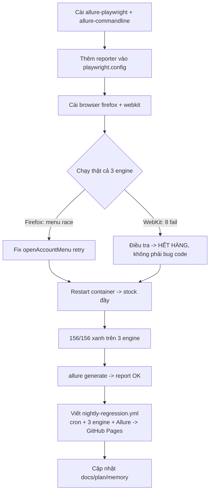

# Tuần 5 — Hiểu từng bước triển khai: Reporting + Cross-browser + Nightly CI

> Cùng phong cách với `week4-process.md`: mỗi mảnh có **(1) làm gì**, **(2) code thật**, **(3) vì sao**, **(4) không làm vậy thì hỏng gì**. Đọc tuần tự là một hành trình học.

Tuần 5 làm cho bộ test **"trưng bày được"** và **đáng tin trên nhiều trình duyệt**: thêm **Allure trend report**, chạy **đa trình duyệt** (chromium/firefox/webkit), và một **nightly regression** tự publish report lên GitHub Pages. Không thêm test mới — vẫn 52 test — nhưng giờ chạy **× 3 engine = 156 lượt**, đều xanh.

---

## 0. Nguyên tắc vàng (nhắc lại): BUILD → VERIFY THẬT → SỬA GỐC

Tuần 5 ít "probe API" hơn tuần 4, nhưng phần **VERIFY thật** lại là nơi học nhiều nhất: bật đa trình duyệt rồi **chạy thật** mới lộ ra 2 vấn đề — một bug cross-browser thật, và một "lỗi giả" do hết hàng. Bài học xuyên suốt: **chạy thật trên cả 3 engine mới biết code có thật sự chạy đa trình duyệt hay không** — cấu hình project là chưa đủ.



---

## 1. Kiến trúc: Tuần 5 thêm gì vào bức tranh

Tuần 5 không đụng tới tầng POM/API/test — nó thêm **3 trục hạ tầng**:

```
REPORTER (playwright.config)  →  mỗi lần chạy sinh: list (console) + html + allure-results
                                 CI thêm 'github' annotations

BROWSER MATRIX (projects)     →  1 bộ test chạy trên chromium / firefox / webkit
                                 (đã khai báo từ Tuần 1, giờ mới CÀI browser + CHẠY thật)

CI (2 workflow)               →  smoke.yml   : @smoke, chromium, mỗi push (Tuần 4)
                                 nightly-*.yml: @regression, 3 engine, cron -> Allure -> Pages
```

**Ý tưởng cốt lõi Tuần 5:**

> Cùng một bộ test, cùng một config, phục vụ **nhiều ngữ cảnh** khác nhau nhờ **projects** (chọn engine) và **tags + grep** (chọn phạm vi). Push thì chạy nhanh (smoke/chromium); ban đêm chạy sâu (regression/3 engine) và xuất báo cáo công khai.

---

## 2. Bước 1 — Tích hợp Allure (code thật)

**Làm gì:** cài 2 gói, thêm reporter, thêm script.

```bash
npm i -D allure-playwright allure-commandline
```

- `allure-playwright`: **reporter** — trong lúc test chạy nó ghi kết quả (JSON/attachments) vào thư mục `allure-results/`.
- `allure-commandline`: **CLI** — biến `allure-results/` thành website HTML (`allure-report/`). CLI này chạy trên **Java (JRE)**.

**Reporter trong `playwright.config.ts`:**

```ts
reporter: [
  ['list'], // log trực tiếp ra console
  ['html', { open: 'never' }], // report HTML của Playwright, không tự mở
  [
    'allure-playwright',
    {
      resultsDir: 'allure-results',
      environmentInfo: {
        // hiện ở tab "Environment" của Allure
        App: 'OWASP Juice Shop v17.1.1',
        Framework: 'Playwright + TypeScript',
        BaseURL: BASE_URL,
      },
    },
  ],
  ...(IS_CI ? [['github'] as const] : []), // annotations chỉ khi ở CI
],
```

**Script trong `package.json`:**

```json
"allure:generate": "allure generate allure-results --clean -o allure-report",
"allure:open": "allure open allure-report",
"allure:serve": "allure serve allure-results"
```

**Vì sao có cả `html` (Playwright) lẫn Allure?**

- `html` của Playwright: sẵn có, xem nhanh một lần chạy (`npm run report`), có trace viewer.
- **Allure**: đẹp hơn để **trưng bày**, và quan trọng nhất là **trend/history** (biểu đồ pass/fail qua nhiều lần chạy) — thứ interviewer bấm vào xem được. Đây là mục tiêu "link report public" của Tuần 5.

**Nếu không làm vậy:** không có report công khai để khoe; chỉ có HTML cục bộ, không có xu hướng theo thời gian.

> ⚠️ **Điểm cần biết:** `allure generate` cần **Java**. Máy này có sẵn Java 21 nên `npm run allure:generate` chạy được; CI sẽ `actions/setup-java`. Đã verify thật: một lần chạy sinh 556 file trong `allure-results/`, `allure generate` build ra `allure-report/index.html` thành công.

---

## 3. Bước 2 — Đa trình duyệt (chromium/firefox/webkit)

**Làm gì:** cài 2 browser còn thiếu, rồi **chạy thật** từng engine.

```bash
npx playwright install firefox webkit    # chromium đã có từ Tuần 1
```

Ba `projects` đã khai báo sẵn trong `playwright.config.ts` từ Tuần 1:

```ts
projects: [
  { name: 'chromium', use: { ...devices['Desktop Chrome'] } },
  { name: 'firefox', use: { ...devices['Desktop Firefox'] } },
  { name: 'webkit', use: { ...devices['Desktop Safari'] } },
],
```

Script chọn engine:

```json
"test:chromium": "playwright test --project=chromium",
"test:firefox": "playwright test --project=firefox",
"test:webkit": "playwright test --project=webkit"
```

**Vì sao biểu diễn engine bằng `projects`?** Vì cùng một config có thể phục vụ nhiều ngữ cảnh CI: `--project=chromium --grep @smoke` cho mỗi push, và chạy cả 3 project cho nightly — **không nhân đôi config**. `npm test` (không lọc) chạy cả 3; dev thường dùng `test:chromium` cho nhanh.

**Nếu không làm vậy:** chỉ biết test chạy trên Chromium; bug riêng Firefox/WebKit (rất thật — xem Bước 3) lọt lưới.

---

## 4. Bước 3 — VERIFY THẬT: 2 vấn đề lộ ra (phần học nhất)

Đây là lý do "chạy thật" quan trọng hơn "cấu hình xong". Bật 3 engine rồi chạy, hai chuyện xảy ra:

### Vấn đề 1 — Bug THẬT trên Firefox: menu tài khoản không mở

- **Triệu chứng:** Firefox 51/52 — chỉ test "a registered user can log in" fail: `#navbarLogoutButton` không thấy. Nhưng snapshot cho thấy nút giỏ hàng đã hiện ⇒ **user ĐÃ đăng nhập**, chỉ là menu không mở.
- **Nguyên nhân:** ngay sau khi bấm login, app **redirect** (sang `/#/search`). Test bấm `#navbarAccount` **trong lúc** redirect đang diễn ra; trên Firefox cú click bị "nuốt" hoặc menu mở rồi bị navigation đóng lại → menu không ở trạng thái mở → không có nút logout trong DOM.
- **Cách sửa (code thật, `src/pages/navbar.component.ts`):** biến `openAccountMenu()` thành **retry tới khi menu thật sự mở** (một menu item hiện ra):

```ts
async openAccountMenu(): Promise<void> {
  // menu có thể không mở nếu bấm khi redirect sau login còn đang settle (thấy trên Firefox)
  const anyItem = this.page.locator('#navbarLoginButton, #navbarLogoutButton').first();
  if (await anyItem.isVisible().catch(() => false)) return; // đã mở sẵn
  for (let attempt = 0; attempt < 3; attempt++) {
    await this.accountButton.click();
    try {
      await anyItem.waitFor({ state: 'visible', timeout: 2000 });
      return; // mở thành công
    } catch {
      // menu chưa mở (hoặc bị navigation đóng) -> thử lại
    }
  }
  await anyItem.waitFor({ state: 'visible' });
}
```

**Bài học:** đây là bug cross-browser **thật**, sửa ở POM (một chỗ, mọi caller hưởng lợi). Cách sửa đúng là **chờ đúng trạng thái đích** (menu item hiện) và retry, không phải `sleep`.

### Vấn đề 2 — "Lỗi giả" trên WebKit: 8 test đỏ hoá ra là HẾT HÀNG

- **Triệu chứng:** WebKit 44/52 — 8 test fail, tất cả liên quan `POST /api/BasketItems` (kể cả 1 test **thuần API**). Trông như bug riêng WebKit.
- **Điều tra:** một test **thuần API** mà đỏ trên WebKit thì rất vô lý — `request` context không phụ thuộc engine. Nên mình **tái hiện bằng curl** với user mới toanh:

```bash
curl ... -X POST /api/BasketItems -d '{"ProductId":1,"BasketId":"...","quantity":2}'
# → 400 {"error":"We are out of stock! Sorry for the inconvenience."}
```

- **Nguyên nhân gốc:** **hết hàng, không phải bug code.** Juice Shop mỗi sản phẩm có stock hữu hạn (`/api/Quantitys`): Apple Juice (id 1) `quantity: 38`, `limitPerUser: 5`; Orange (id 2) `quantity: 83`. **Đặt hàng làm giảm stock**; chạy cả bộ test hàng chục lần trong phiên (weeks 1–4 lặp + chromium + firefox) đã rút cạn Apple Juice. WebKit chạy **cuối cùng** nên "lãnh đủ" — nó không có lỗi gì cả.
- **Cách sửa:** `docker compose restart` → Juice Shop **re-seed** DB → stock đầy lại → chạy lại WebKit: **52/52 xanh**. Đóng gói thành thói quen: `npm run app:reset`, và CI luôn dùng container **fresh** nên không bao giờ gặp.

**Bài học (quan trọng):** khi một test **thuần API** đỏ chỉ trên một engine, hãy nghi ngờ **trạng thái/môi trường** trước khi nghi ngờ code. Đọc **body lỗi thật** (không chỉ status) là chìa khoá — `400` chỉ nói "sai", còn `"out of stock"` mới chỉ ra gốc rễ.

> Sau 2 sửa đổi: **restart container (stock đầy) → chạy cả 3 engine → 156/156 xanh (~1.6 phút).** Cross-browser code là đúng; menu race là bug thật duy nhất.

---

## 5. Bước 4 — Đọc `nightly-regression.yml` dòng-by-dòng

> 📘 Nền tảng CI/GitHub Actions (khái niệm, recipe tái dùng): [docs/setup/ci.md](../setup/ci.md). Phần `docker compose up -d` + `wait-for-app`: [docs/setup/docker.md](../setup/docker.md).

Đây là deliverable "link report public". Chạy theo lịch, cả 3 engine, deploy Allure lên GitHub Pages bằng **cơ chế Pages chính thức** (`actions/deploy-pages`) — khớp với Settings → Pages → Source = **"GitHub Actions"**. **Không cần nhánh `gh-pages`.**

```yaml
on:
  schedule:
    - cron: '0 18 * * *' # 18:00 UTC ≈ 01:00 giờ VN
  workflow_dispatch: # cho phép bấm chạy tay

permissions: # quyền cho official Pages deployment
  contents: read
  pages: write
  id-token: write

concurrency:
  group: pages # không cho 2 lần deploy Pages đè nhau
  cancel-in-progress: false
```

Workflow chia **3 job**: `regression` (chạy test + build report), `deploy` (đẩy lên Pages), `status` (báo đỏ nếu test fail).

**Job `regression`** (theo thứ tự, kèm _vì sao_):

1. `checkout` → `setup-node@v4` (Node 20, cache npm).
2. **`setup-java@v4` (temurin 21)** — vì `allure generate` cần JRE. _(Đây là lý do bước này không có ở smoke.yml.)_
3. `npm ci` → cache browser Playwright (key băm `package-lock.json`).
4. `playwright install --with-deps chromium firefox webkit` — **cả 3** engine (smoke chỉ cài chromium).
5. `docker compose up -d` → `npm run app:wait`. **Container fresh ⇒ stock đầy** → tránh đúng cái bẫy hết hàng ở Bước 3.
6. **Restore trend history từ cache** (giải thích ở dưới).
7. **Chạy test — `continue-on-error: true`** (không fail job ngay để còn deploy report):

```yaml
- name: Run @regression across all browsers
  id: regression
  run: npx playwright test --grep @regression
  continue-on-error: true
```

8. `docker compose down` (`if: always()`) — luôn dọn.
9. **Generate Allure (bơm history cũ vào, rồi lưu history mới lại):**

```yaml
- name: Generate Allure report (preserving trend history)
  if: always()
  run: |
    if [ -d allure-history-store ]; then
      cp -r allure-history-store allure-results/history   # history cũ -> có trend
    fi
    npx allure generate allure-results --clean -o allure-report
    rm -rf allure-history-store
    cp -r allure-report/history allure-history-store        # lưu history mới cho lần sau
```

10. **Upload report làm Pages artifact** (không phải push nhánh):

```yaml
- name: Upload report as the Pages artifact
  if: always()
  uses: actions/upload-pages-artifact@v3
  with:
    path: allure-report
```

11. Upload `allure-report/` + `playwright-report/` làm build artifact (`if: always()`, giữ 14 ngày).

**Job `deploy`** — `needs: regression`, `if: always()`, chạy `actions/deploy-pages@v4` với `environment: github-pages`. Đây là bước đưa report công khai lên `https://tpqhuy.github.io/QA_Auto_Project_JuiceOWASP/`.

**Job `status`** — `needs: regression`, `if: always()`, chỉ `exit 1` khi `needs.regression.outputs.result == 'failure'`.

**Vì sao tách 3 job + `continue-on-error`?** Ta muốn report **luôn được deploy** kể cả khi có test đỏ (để đi xem lỗi trên report công khai), nhưng overall run vẫn phải **đỏ** để báo hiệu. Job `regression` giữ "xanh" (test dùng `continue-on-error`) để artifact được upload và cache history được lưu; job `deploy` chạy bất kể; còn việc báo đỏ đẩy sang job `status` riêng.

**Vì sao giữ `history` bằng cache (không phải nhánh gh-pages)?** Allure vẽ biểu đồ xu hướng từ thư mục `history`. Với cơ chế Pages chính thức không có nhánh `gh-pages` để lấy report cũ, nên ta dùng `actions/cache`: key duy nhất mỗi lần chạy (`allure-history-${{ github.run_id }}`) + `restore-keys: allure-history-` để phục hồi bản gần nhất; copy vào `allure-results/history` **trước khi** generate → report có trend qua nhiều đêm.

---

## 6. Bước 5 — Độ ổn định (đã có sẵn, giờ chốt lại)

Tuần 5 không phải bắt đầu từ đầu về ổn định — nền đã đặt từ trước, giờ xác nhận đủ cho cross-browser:

| Cơ chế                                                        | Nơi                            | Vai trò                                                     |
| ------------------------------------------------------------- | ------------------------------ | ----------------------------------------------------------- |
| `trace: 'on-first-retry'`                                     | `playwright.config.ts`         | timeline debug khi retry                                    |
| `screenshot: 'only-on-failure'`, `video: 'retain-on-failure'` | config                         | bằng chứng khi đỏ                                           |
| `retries: 2` (CI) / `1` (local)                               | config                         | hấp thụ blip, không che bug                                 |
| `workers: 2` (CI) / `4` (local)                               | config                         | cap để container SQLite đơn không quá tải                   |
| `waitUntil: 'domcontentloaded'`                               | `base.page.ts` (Tuần 4)        | tránh goto timeout dưới tải — quan trọng cho firefox/webkit |
| `openAccountMenu` retry                                       | `navbar.component.ts` (Tuần 5) | fix race cross-browser                                      |

**Điểm quan trọng:** worker cap là **toàn cục**, không phải mỗi project — nên chạy 3 engine cùng lúc **không** tăng tải tức thời (vẫn tối đa 4 test song song), chỉ dài hơn về tổng thời gian. Vì vậy 156 lượt vẫn ổn định như 52 lượt.

---

## 7. Tự kiểm tra hiểu bài

1. Vì sao dùng cả report HTML của Playwright **và** Allure? _(HTML xem nhanh/trace; Allure có trend + publish công khai)_
2. `allure-playwright` và `allure-commandline` khác nhau thế nào, và cái nào cần Java? _(reporter ghi results; CLI build HTML, cần JRE)_
3. Vì sao smoke.yml **không** có bước `setup-java` mà nightly thì có? _(chỉ nightly generate Allure)_
4. Bug Firefox thật là gì và sửa ở đâu? _(menu race sau redirect login; `openAccountMenu` retry)_
5. Tại sao 8 test "đỏ trên WebKit" **không** phải bug WebKit? Làm sao biết? _(hết hàng; tái hiện bằng curl, đọc body `"out of stock"`)_
6. Vì sao regression phải chạy trên container **fresh**? _(stock hữu hạn, đặt hàng làm giảm; fresh = re-seed đầy)_
7. Giải thích pattern `continue-on-error` → publish → `exit 1` cuối job. _(publish report kể cả khi đỏ, nhưng job vẫn báo đỏ)_
8. Trend history của Allure được giữ bằng cách nào giữa các đêm? _(dùng `actions/cache` phục hồi `history` bản gần nhất, copy vào `allure-results/history` trước khi generate)_

---

## 8. Tổng kết & cách chạy lại

### File thay đổi

| File                                       | Thay đổi                                                                                                                         |
| ------------------------------------------ | -------------------------------------------------------------------------------------------------------------------------------- |
| `package.json`                             | +dev deps `allure-playwright`/`allure-commandline`; +scripts `allure:*`, `test:firefox/webkit`, `test:crossbrowser`, `app:reset` |
| `playwright.config.ts`                     | Thêm reporter `allure-playwright` (+`environmentInfo`), `github` chỉ khi CI                                                      |
| `src/pages/navbar.component.ts`            | `openAccountMenu()` retry-tới-khi-mở (fix race Firefox)                                                                          |
| `.github/workflows/nightly-regression.yml` | **Mới** — cron, 3 engine, Allure + trend → GitHub Pages                                                                          |
| `.gitignore`                               | +`gh-pages/`                                                                                                                     |
| `docs/*`, `README.md`, plan, `MEMORY.md`   | Đồng bộ Tuần 5 (badge nightly, link Allure, stock quirk, cross-browser)                                                          |

### Số liệu

| Chỉ số      | Tuần 4        | Tuần 5                               |
| ----------- | ------------- | ------------------------------------ |
| Số test     | 52            | 52 (không đổi)                       |
| Lượt chạy   | 52 (chromium) | **156** (× 3 engine)                 |
| Trình duyệt | chromium      | **chromium + firefox + webkit** ✅   |
| CI          | smoke         | smoke **+ nightly (Allure → Pages)** |

### Chạy lại

```bash
npm run app:reset          # container fresh -> stock đầy (tránh "out of stock")
npm test                   # cả 3 engine (156 lượt)
npm run allure:serve       # xem Allure report cục bộ (cần Java)
```

### Khi push lên GitHub

- Bật **GitHub Pages**: Settings → Pages → Source = **"GitHub Actions"** (không cần nhánh `gh-pages` — workflow dùng `actions/deploy-pages`).
- Chạy workflow `nightly-regression` (tab Actions → Run workflow) hoặc chờ cron → Allure tự deploy lên `https://tpqhuy.github.io/QA_Auto_Project_JuiceOWASP/`.

### 4 bài học cốt lõi

1. **Cấu hình project ≠ chạy được đa trình duyệt** — phải chạy thật cả 3 engine mới biết.
2. **Đọc body lỗi, đừng chỉ nhìn status** — `"out of stock"` giải mã ngay "bug WebKit" tưởng tượng.
3. **Test thuần API đỏ theo engine ⇒ nghi môi trường/state trước** — không phải code.
4. **Report luôn phải publish kể cả khi đỏ** — `continue-on-error` + fail cuối job; và giữ `history` để có trend.
