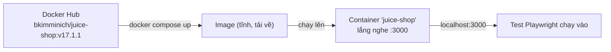

# Docker trong project này — học từ thực tế

> Note cho người mới. Bạn đã nắm ý chính: _Docker giúp tái tạo môi trường đồng đều trên mọi máy_. File này giải thích **Docker được dùng cụ thể ra sao trong project**, từng dòng cấu hình, từng lệnh — để bạn học Docker bằng ví dụ thật thay vì lý thuyết suông.

Trong project này Docker chỉ làm **một việc**: dựng sẵn app **OWASP Juice Shop** ở `http://localhost:3000` để test chạy vào. Bạn **không tự build** app — chỉ **tải về một bản đóng gói sẵn rồi chạy**.

> 🔗 **Xem Docker được setup thực tế theo tiến trình:**
>
> - [Tuần 1 — Nền móng](../processes/week1-process.md) → _Bước 2–3_: dựng Docker + healthcheck + `wait-for-app` (đây là nơi Docker ra đời trong project).
> - [Tuần 4 — CI smoke](../processes/week4-process.md) và [Tuần 5 — nightly/cross-browser](../processes/week5-process.md) → cách CI trên GitHub tự `docker compose up`.
>
> Các file đó kể "làm gì theo thứ tự"; file này giải thích "Docker hoạt động ra sao". Đọc kèm nhau sẽ đủ cả bức tranh.

---

## 1. Ba khái niệm Docker phải nắm (3 phút)

| Khái niệm          | Là gì                                                                                                         | Ví von                                 |
| ------------------ | ------------------------------------------------------------------------------------------------------------- | -------------------------------------- |
| **Image**          | Gói **tĩnh** chứa sẵn app + runtime + thư viện + 1 phần OS. Tải từ Docker Hub.                                | "Khuôn bánh" / bản cài đặt đóng băng   |
| **Container**      | Một **image đang chạy** → app sống, phục vụ request.                                                          | "Cái bánh đang nóng" nướng ra từ khuôn |
| **Docker Hub**     | Kho image công khai trên mạng (như npm cho image).                                                            | App Store cho image                    |
| **docker compose** | Công cụ đọc file `docker-compose.yml` để chạy container bằng **1 lệnh** thay vì gõ `docker run ...` dài dòng. | "Kịch bản" dựng sẵn                    |

Luồng cơ bản: **Docker Hub → (pull) Image → (run) Container**.



> **Image vs Container** là chỗ người mới hay nhầm nhất: Image = file tĩnh tải về; Container = tiến trình đang chạy từ image đó. Một image có thể tạo ra nhiều container.

---

## 2. Toàn bộ cấu hình: `docker-compose.yml` (giải mã từng dòng)

```yaml
services:
  juice-shop: # tên service (tuỳ đặt)
    image: bkimminich/juice-shop:v17.1.1 # (1) lấy image nào, version nào
    container_name: juice-shop # (2) đặt tên container cho dễ gọi
    ports:
      - '3000:3000' # (3) map cổng máy bạn -> cổng trong container
    environment:
      - NODE_ENV=unsafe # (4) biến môi trường truyền vào app
    healthcheck: # (5) cách Docker biết app đã "khoẻ" chưa
      test:
        [
          'CMD',
          '/nodejs/bin/node',
          '-e',
          "require('http').get('http://localhost:3000/rest/admin/application-version', r => process.exit(r.statusCode === 200 ? 0 : 1)).on('error', () => process.exit(1))",
        ]
      interval: 10s
      timeout: 5s
      retries: 12
      start_period: 20s
    restart: unless-stopped # (6) tự bật lại nếu container chết
```

**(1) `image: ...:v17.1.1` — PIN version.**
Không dùng `:latest`. Vì `latest` hôm nay khác hôm sau → test có thể vỡ mà không hiểu vì sao. Ghim version cố định = môi trường **bất biến**; muốn nâng cấp thì tự sửa số rồi chạy lại test có chủ đích.

**(2) `container_name`.** Đặt tên `juice-shop` để gõ `docker logs juice-shop` thay vì phải tra id dài.

**(3) `ports: '3000:3000'` — port mapping (rất quan trọng).**
Định dạng `HOST:CONTAINER`. Container chạy app ở cổng 3000 _bên trong_ nó (cô lập); dòng này "mở cửa" nối cổng 3000 của **máy bạn** vào cổng 3000 _trong_ container → nhờ vậy trình duyệt/Playwright ở máy bạn vào được `localhost:3000`. Không có dòng này, app chạy nhưng bạn không truy cập được.

**(4) `environment: NODE_ENV=unsafe`.**
Truyền biến môi trường vào app lúc chạy. Ở đây bật chế độ giữ tất cả tính năng/challenge của Juice Shop cho việc test. Đây là cách **cấu hình app mà không sửa image**.

**(5) `healthcheck` — Docker tự kiểm tra app "sống" chưa.**
Docker định kỳ chạy lệnh `test`; exit code 0 = khoẻ. Ở đây gọi thử endpoint version, chỉ khoẻ khi HTTP 200.

- `interval: 10s` — 10 giây kiểm 1 lần; `timeout: 5s` — mỗi lần chờ tối đa 5s; `retries: 12` — thử 12 lần mới coi là "unhealthy"; `start_period: 20s` — 20s đầu bỏ qua (app đang khởi động).
- 🐞 **Bẫy thực tế (rất đáng học):** image Juice Shop là **distroless** — không có shell, không `curl`/`wget`, và lệnh `node` **không nằm trên `$PATH`**. Nó ở đường dẫn tuyệt đối **`/nodejs/bin/node`**. Nếu viết healthcheck kiểu `curl ...` hay `node ...` sẽ **âm thầm fail** → container "unhealthy" mãi. Bài học: mỗi image có môi trường bên trong khác nhau, phải biết nó có gì.

**(6) `restart: unless-stopped`.** Nếu container tự chết (crash), Docker bật lại — trừ khi bạn chủ động `down`/`stop`.

> **Không có `build:` / `Dockerfile`** ở đây → project **không tự build image**, chỉ **pull** image công khai về chạy. (Muốn tự build mới cần source app + Dockerfile — xem mục 7.)

---

## 3. Vòng đời lệnh trong project (dùng qua `npm run`)

Project bọc các lệnh Docker vào npm script (xem `package.json`) cho gọn:

| Lệnh                | Bên dưới nó chạy gì             | Khi nào dùng                             |
| ------------------- | ------------------------------- | ---------------------------------------- |
| `npm run app:up`    | `docker compose up -d`          | Dựng Juice Shop (nền, `-d` = detached)   |
| `npm run app:wait`  | `node scripts/wait-for-app.mjs` | Chờ app **thật sự** trả 200 rồi mới test |
| `npm run app:down`  | `docker compose down`           | Xoá container + network khi xong         |
| `npm run app:reset` | `docker compose restart` + wait | **Reset data về ban đầu** (re-seed)      |

**Thử ngay (thứ tự chuẩn):**

```bash
npm run app:up      # kéo image (lần đầu) + chạy container
npm run app:wait    # chờ tới khi app sẵn sàng
npm test            # chạy test vào localhost:3000
npm run app:down    # dọn dẹp
```

**Vì sao có `app:reset`?** Juice Shop **re-seed toàn bộ dữ liệu mỗi lần khởi động** (DB SQLite nằm trong container, tạm thời). Chạy test nhiều lần làm hao "tồn kho" sản phẩm → `restart` = container khởi động lại = **kho đầy lại**. Đây là ví dụ về **container có state tạm (ephemeral)**: khởi động lại là sạch.

> 💾 **Về `volume` (và vì sao project KHÔNG dùng):** `volume` là cách Docker **lưu dữ liệu ra ngoài** để container xoá đi vẫn còn. Project này **cố ý không gắn volume** cho Juice Shop → mỗi lần khởi động là DB sạch, tồn kho đầy lại. Với môi trường TEST, "state sạch, tái lập được" quan trọng hơn "giữ dữ liệu". (Ngược lại, một app thật — vd Postgres — thường cần volume để không mất data.)

---

## 4. `wait-for-app.mjs` — "container up ≠ app ready"

`docker compose up -d` trả về ngay khi **container đã bật**, NHƯNG app Angular bên trong cần thêm vài giây mới **phục vụ được request**. Nếu test chạy ngay lúc đó → lỗi giả (race).

`scripts/wait-for-app.mjs` giải quyết: **poll** `GET /rest/admin/application-version` mỗi 3s cho tới khi nhận **200** (tối đa 120s) rồi mới cho đi tiếp.

> Bài học chung: sau khi `up`, luôn **đợi một tín hiệu sẵn sàng** (health/endpoint), đừng `sleep` bừa. Đây là lý do có cả `healthcheck` (Docker tự biết) lẫn `wait-for-app` (script chủ động chờ).

---

## 5. Docker trong CI (GitHub Actions) — điểm ăn tiền

> 🔗 Toàn bộ về CI (workflow/job/step, 2 pipeline của project, công thức tái dùng): [docs/setup/ci.md](./ci.md).

Runner CI là một **máy Ubuntu trống** trên cloud. Nhờ Docker, nó tự dựng được app y hệt máy bạn — chỉ vài dòng trong workflow:

```yaml
- name: Start Juice Shop
  run: docker compose up -d
- name: Wait for Juice Shop to be ready
  run: npm run app:wait
- name: Run tests
  run: npx playwright test ...
- name: Tear down
  if: always()
  run: docker compose down
```

→ Cùng một `docker-compose.yml`, chạy giống nhau ở **local và CI**. CI luôn dùng container **mới tinh** nên kho luôn đầy (không gặp lỗi hết hàng). Đây chính là giá trị "tái tạo môi trường đồng đều" mà bạn đã nắm — thể hiện bằng ví dụ thật.

---

## 6. Lệnh Docker thuần nên biết (để soi/ gỡ lỗi)

Không bắt buộc trong workflow hằng ngày, nhưng học Docker thì nên biết:

```bash
docker ps                     # liệt kê container ĐANG chạy (+ trạng thái health)
docker ps -a                  # gồm cả container đã dừng
docker images                 # các image đã tải về máy
docker logs juice-shop        # xem log app trong container
docker logs -f juice-shop     # theo dõi log realtime (-f = follow)
docker exec -it juice-shop /nodejs/bin/node -v   # chạy lệnh BÊN TRONG container
docker inspect --format '{{.State.Health.Status}}' juice-shop   # xem trạng thái healthcheck
docker stop juice-shop        # dừng container (không xoá)
docker start juice-shop       # bật lại container đã dừng
docker compose down -v        # down + xoá cả volume (nếu có)
docker system prune           # dọn image/container rác (giải phóng ổ đĩa)
```

Ghi nhớ ánh xạ:

- `compose up` ≈ `docker run` nhưng theo file cấu hình.
- `exec -it` = "bước vào trong" container để chạy lệnh (như SSH nhẹ). `-it` = interactive terminal.
- `logs` = cách đầu tiên để biết vì sao app trong container lỗi.

---

## 7. Nếu muốn TỰ BUILD image (mở rộng)

Project này **không** làm bước này (dùng image có sẵn), nhưng để biết: muốn đóng gói _app của chính bạn_ thành image, bạn cần **source code + một `Dockerfile`** mô tả cách build, ví dụ:

```dockerfile
FROM node:20-alpine        # image nền
WORKDIR /app
COPY package*.json ./
RUN npm ci                  # cài deps
COPY . .
RUN npm run build          # build app
EXPOSE 3000
CMD ["node", "dist/main.js"]   # lệnh chạy khi container start
```

Rồi `docker build -t my-app .` để tạo image, `docker run -p 3000:3000 my-app` để chạy. → Đây là lúc **cần source code**; còn dùng image công khai (như project này) thì không.

---

## 8. Xử lý sự cố thường gặp

| Triệu chứng                                                   | Nguyên nhân & cách xử lý                                                                                     |
| ------------------------------------------------------------- | ------------------------------------------------------------------------------------------------------------ |
| `cannot connect to the Docker daemon` / `docker compose` treo | **Docker Desktop chưa bật.** Mở Docker Desktop, chờ "Running" rồi chạy lại.                                  |
| `Bind for 0.0.0.0:3000 failed: port is already allocated`     | Cổng 3000 đang bị app khác chiếm. Tắt app đó, hoặc đổi `ports` thành `'3001:3000'` rồi vào `localhost:3001`. |
| Test đỏ ngay đầu / trắng trang                                | App chưa sẵn sàng. Luôn chạy `npm run app:wait` sau `app:up`.                                                |
| Container "unhealthy"                                         | Xem log `docker logs juice-shop`; kiểm tra `docker inspect --format '{{.State.Health.Status}}' juice-shop`.  |
| `400 out of stock` khi test đặt hàng                          | Tồn kho cạn sau nhiều lần chạy → `npm run app:reset` để re-seed.                                             |
| Kéo image lần đầu lâu                                         | Bình thường (tải ~vài trăm MB một lần); lần sau dùng cache nên nhanh.                                        |

> Lệnh vàng khi bí: **`docker logs juice-shop`** — phần lớn lỗi container lộ ra ở đây.

---

## 9. Cheat-sheet rút gọn

- **Image** (tĩnh, tải về) → **Container** (đang chạy). Pull từ **Docker Hub**.
- `docker-compose.yml` = kịch bản dựng bằng 1 lệnh. Project chỉ có 1 service `juice-shop`, **pull image công khai, không build**.
- Nhớ 3 dòng cấu hình quan trọng: **`image` (pin version)** · **`ports HOST:CONTAINER`** · **`healthcheck`** (chú ý bẫy distroless `/nodejs/bin/node`).
- Vòng đời: `app:up` → `app:wait` → `test` → `app:down`; `app:reset` để làm mới data.
- **container up ≠ app ready** → luôn chờ tín hiệu sẵn sàng.
- CI tái dùng đúng file compose → môi trường **giống nhau local & cloud** (đây là mục đích của Docker).
- Cần source code **chỉ khi tự build image** (viết Dockerfile); dùng image có sẵn thì không.
